# Compliance Ledger Explorer: manual de utilização

## 1. Abrir a plataforma com Simple mode off

O Compliance Ledger Explorer reúne as decisões técnicas registadas no protótipo da dissertação. Permite consultar a política aplicada a um evento, conferir a integridade dos registos e realizar exercícios de demonstração. A avaliação dos eventos cabe ao Compliance Oracle, que emite as decisões apresentadas.

Pode utilizar a plataforma sem instalar programas, criar uma conta ou conhecer programação.

Este manual usa a vista completa: «Simple mode: off», ou «Modo simples: off» na interface portuguesa. Todos os percursos partem desse estado. A «Vista de auditor (Art. 78)» também fica desligada, exceto no exercício de divulgação seletiva da secção 12 e nos momentos guiados que a ativam.

1. Se recebeu uma pasta comprimida, extraia o seu conteúdo antes de abrir os ficheiros.
2. Abra `LEDGER_EXPLORER.html` num browser atualizado, como Chrome, Edge, Firefox ou Safari. Se recebeu uma ligação publicada, abra essa ligação.
3. Aguarde que a página termine a abertura. Na primeira visita, a interface abre em inglês; se surgir o guia de boas-vindas, selecione «Explore without a guide» para aceder ao menu. Em português, este comando chama-se «Explorar sem guia».
4. No grupo «View», clique em «EN · PT» para mudar para português. O grupo passa a chamar-se «Vista», e o botão «PT · EN» permite regressar ao inglês. Pode reabrir o guia através de «Guia de leitura».
5. Desloque o menu lateral até ao grupo «Vista». Leia o estado junto de «Modo simples»: tem de ser `off`. Se indicar `on`, clique uma vez em «Modo simples» e confirme `off`. Em inglês, o comando é «Simple mode».
6. Confirme que «Vista de auditor (Art. 78)» também indica `off`. Se estiver `on`, clique uma vez para a desligar. Deve poder ver os motivos e os campos de identificação nos registos.
7. Confirme que o menu inclui «Sala de operações», «Decisões de arquitetura», «Mais cadeias», «Rede Fabric», «Ligar a sua plataforma» e «Abrir um ledger». Desloque o menu para baixo se as últimas entradas estiverem fora da área visível.

As imagens deste manual podem ser abertas no tamanho original: clique numa captura para a abrir noutro separador e use o zoom do browser para ler os detalhes. As imagens ilustram a interface; os botões nelas representados só funcionam na plataforma.

Para manter o manual visível enquanto explora, abra num novo separador uma das ligações à plataforma presentes nas secções seguintes. Use o menu do botão direito do rato. Os percursos deste manual usam os nomes da interface portuguesa.

As verificações criptográficas dependem das capacidades do browser. Leia o aviso de suporte apresentado pela aplicação. Se indicar que não verificou as assinaturas, atualize o browser ou experimente outro; a confirmação dos hashes, por si só, é um resultado parcial.

A leitura e a verificação dos ficheiros carregados decorrem neste browser. A aplicação não envia esses ficheiros para um serviço externo. Ao abrir uma versão publicada, o browser precisa de obter a página no endereço fornecido; depois de descarregar a versão HTML local, pode consultá-la sem ligação à Internet.

O explorador contém sete cadeias e 1 831 registos nesta versão. As cadeias curtas são verificadas integralmente no browser. Na cadeia Steel, com 1 750 registos, a verificação no browser abrange 62 registos completos embebidos; o restante conteúdo é apresentado em forma compacta. O resultado integral indicado nessa página foi calculado durante a geração do explorador.

## 2. Escolher um percurso e usar o menu

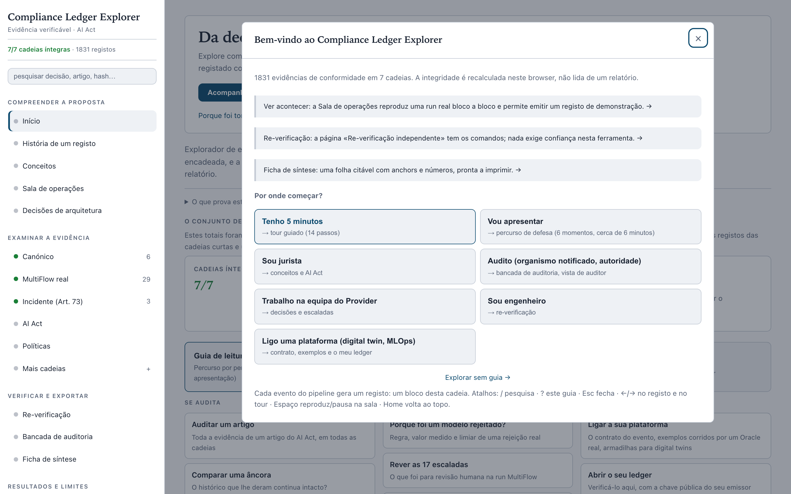

O «Guia de leitura» pode ser reaberto no menu ou com a tecla `?`. Os cartões ajudam a escolher a primeira página; pode mudar de percurso a qualquer momento.

| Destinatário | Percurso sugerido | Tarefa a realizar |
|---|---|---|
| Comunidade e primeira visita | «Tenho 5 minutos», ou «História de um registo» → «Conceitos» → «Canónico» | Compreender a proposta e abrir um exemplo concreto. |
| Arguentes | «Percurso de defesa» → «AI Act» → «Bancada de auditoria» → «Âmbito e limitações» | Confrontar uma afirmação com o registo que a sustenta e com o seu limite. |
| Orientadores | «História de um registo» → «Políticas» → «Custo e adulteração» → «Âmbito e limitações» | Rever a relação entre a decisão, o ensaio e a interpretação dos resultados. |
| Auditores e investigadores | «Re-verificação» → «Bancada de auditoria» → «Ficha de síntese» | Verificar registos, conservar resultados e repetir uma amostra. |
| Equipas técnicas | «Ligar a sua plataforma» → «Abrir um ledger» | Consultar o contrato e verificar ficheiros compatíveis. |

Para seguir este manual, entre por «Explorar sem guia» e escolha as páginas no menu completo. O cartão «Sou jurista» liga o modo simples; se o selecionar, volte a «Vista» e reponha «Modo simples: off» antes de continuar. «Audito» liga a vista de auditor, que deve repor em `off` para examinar os detalhes completos. Os percursos sugeridos na tabela não exigem a seleção desses cartões.

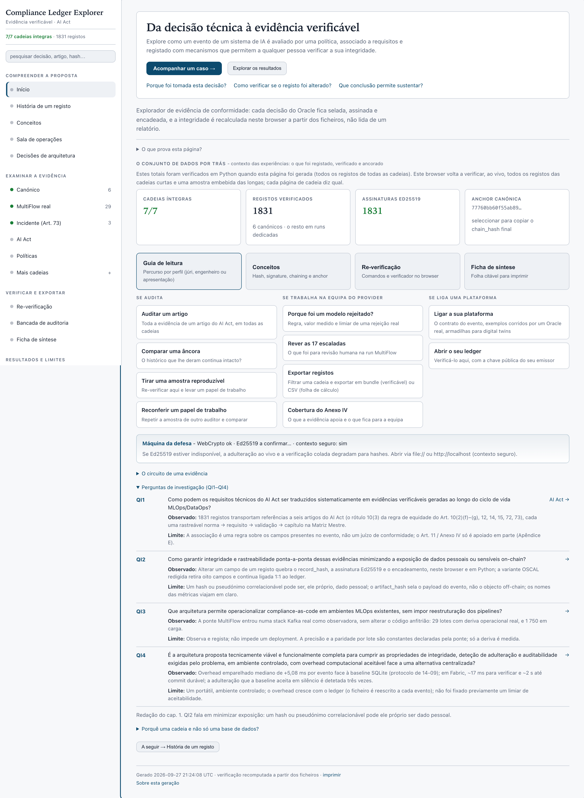

### Uma primeira verificação

Este exercício usa apenas os dados incluídos na plataforma:

1. Abra [Canónico](../Project/ledger_explorer/LEDGER_EXPLORER.html#canonico) e escolha «Registos» na barra «Nesta página».
2. Selecione «rejeitado». Devem aparecer três registos. Abra o #1: o motivo indica precisão 0,74, abaixo do limiar 0,80.
3. Feche o detalhe e abra [Re-verificação](../Project/ledger_explorer/LEDGER_EXPLORER.html#verify). Selecione «Carregar exemplo (canónico #1)»; o exemplo inicia a verificação automaticamente.
4. Confira os resultados de `record_hash`, `chain_hash` e assinatura. A ligação ao anterior fica sem confirmação porque recebeu apenas um registo. Se o browser não verificar Ed25519, a assinatura permanece por verificar.
5. Abra [Bancada de auditoria](../Project/ledger_explorer/LEDGER_EXPLORER.html#audit), escolha «Canónico», deixe o artigo em «qualquer», indique tamanho `6` e semente `primeira-visita`. Selecione «Tirar e verificar». Com suporte Ed25519, o resultado esperado é 6/6 registos verificados.
6. Descarregue o papel de trabalho e use o mesmo ficheiro em «Reconferir um papel de trabalho». A cadeia, a âncora, as posições e os registos devem coincidir.

Se algum resultado divergir, leia o controlo que falhou e consulte a secção «Resolver dificuldades».

### Páginas disponíveis

O menu está dividido por tarefa:

| Grupo | Páginas e utilização |
|---|---|
| Compreender a proposta | [Início](../Project/ledger_explorer/LEDGER_EXPLORER.html#overview), [História de um registo](../Project/ledger_explorer/LEDGER_EXPLORER.html#historia), [Conceitos](../Project/ledger_explorer/LEDGER_EXPLORER.html#conceitos), [Sala de operações](../Project/ledger_explorer/LEDGER_EXPLORER.html#ops) e [Decisões de arquitetura](../Project/ledger_explorer/LEDGER_EXPLORER.html#adrs). |
| Examinar a evidência | [Canónico](../Project/ledger_explorer/LEDGER_EXPLORER.html#canonico), [MultiFlow real](../Project/ledger_explorer/LEDGER_EXPLORER.html#multiflow_real), [Incidente](../Project/ledger_explorer/LEDGER_EXPLORER.html#incidente), [AI Act](../Project/ledger_explorer/LEDGER_EXPLORER.html#aiact), [Políticas](../Project/ledger_explorer/LEDGER_EXPLORER.html#policies) e «Mais cadeias». |
| Verificar e exportar | [Re-verificação](../Project/ledger_explorer/LEDGER_EXPLORER.html#verify), [Bancada de auditoria](../Project/ledger_explorer/LEDGER_EXPLORER.html#audit) e [Ficha de síntese](../Project/ledger_explorer/LEDGER_EXPLORER.html#ficha). |
| Resultados e limites | [Custo e adulteração](../Project/ledger_explorer/LEDGER_EXPLORER.html#perf), [Rede Fabric](../Project/ledger_explorer/LEDGER_EXPLORER.html#fabric) e [Âmbito e limitações](../Project/ledger_explorer/LEDGER_EXPLORER.html#limits). |
| Integrar (extensão) | [Ligar a sua plataforma](../Project/ledger_explorer/LEDGER_EXPLORER.html#connect) e [Abrir um ledger](../Project/ledger_explorer/LEDGER_EXPLORER.html#open). Estas ferramentas excedem a avaliação original da dissertação. |

Depois de carregar ficheiros ou escrever notas, utilize o menu da plataforma para mudar de página. Voltar a abrir o explorador através de uma ligação do manual pode iniciar outra sessão.

Os percursos guiados ficam em «Ferramentas». Use «Vista» para escolher a língua, o modo simples, o tema e a vista de auditor. Se a janela estiver estreita, abra a navegação lateral pelo botão «Menu».

### Comandos comuns a várias páginas

| Onde clicar | O que aparece e como regressar |
|---|---|
| «O que prova esta página?», por baixo do título | Abre a explicação do alcance da página. Clique no mesmo título para a recolher. |
| Um botão de «Nesta página» | Desloca a página até à secção indicada; não abre um novo separador. Use «↑ Topo» para regressar ao início. |
| Um título precedido de um pequeno triângulo | Expande o conteúdo que estava recolhido. Clique no título novamente para o fechar. |
| «A seguir → …», no fim da página | Abre a próxima página do percurso proposto. Pode escolher outra no menu lateral. |
| «Sobre esta geração», no rodapé | Revela a versão, as referências da geração e o suporte criptográfico do browser. Clique novamente para recolher. |
| «imprimir», no rodapé | Abre a impressão do browser; escolha guardar como PDF se quiser conservar a página. |
| `×`, no canto superior do detalhe de um registo | Fecha o diálogo e devolve a página de origem. Também pode premir `Esc` ou clicar fora do diálogo. |

Os rótulos de requisitos, capítulos e ficheiros nem sempre são ligações. Use os botões e os textos que respondem ao clique; um identificador apresentado como referência pode ter apenas função de leitura.

Para pesquisar, escreva no campo do menu ou prima `/`. A pesquisa procura nas cadeias disponíveis por hash, identificador de evidência (`evidence_id`), cenário, decisão, motivo ou artigo. Cada resultado identifica a cadeia de origem. Clique no resultado para abrir o registo.

### Pesquisa global, incluindo as cadeias de anexo

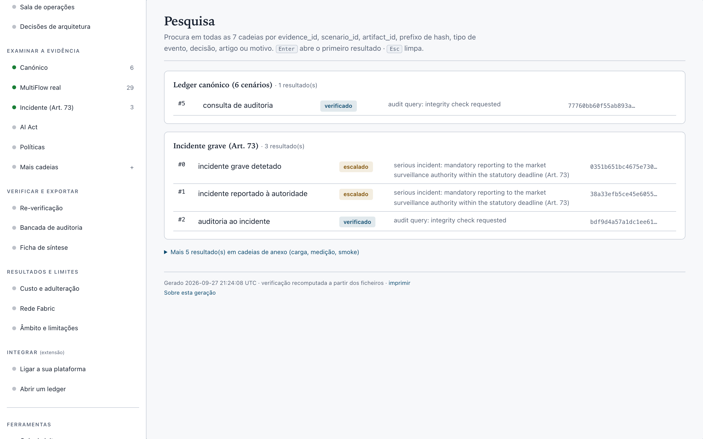

1. Clique na caixa de pesquisa do menu e escreva pelo menos dois caracteres. Experimente `Art. 73`, `drift_detected` ou um prefixo de hash.
2. Leia os resultados agrupados pela cadeia de origem. `Art. 73` e `Art.73` são tratados como a mesma pesquisa.
3. Clique numa linha para abrir o registo. `Enter`, na caixa de pesquisa, abre o primeiro resultado.
4. Quando aparecer «Mais … resultado(s) em cadeias de anexo (carga, medição, smoke)», clique nesse título. Só então ficam visíveis os resultados dessas cadeias.
5. Feche o registo com `×`. Volte à caixa e limpe o texto para iniciar outra pesquisa; `Esc`, com a caixa selecionada, também o limpa.

### Cliques na página de início

1. Clique em «Acompanhar um caso» para abrir a história do registo #1. «Explorar os resultados» abre a cadeia canónica.
2. Clique em «Porque foi tomada esta decisão?» para abrir o mesmo registo. A pergunta sobre alteração leva à sua demonstração; a pergunta sobre a conclusão leva a «Âmbito e limitações».
3. Clique no cartão da âncora para copiar o hash completo, mesmo que o cartão mostre uma forma abreviada.
4. Expanda «O circuito de uma evidência». Clique nos blocos do circuito: evento e registo levam ao Canónico; Oracle leva à Sala de operações; OSCAL leva ao AI Act; auditoria leva à Re-verificação.
5. Abra «Perguntas de investigação (QI1–QI4)» se estiver recolhido. Leia o observado e o limite de cada pergunta antes de seguir a ligação à evidência.
6. Expanda «Porquê uma cadeia e não só uma base de dados?». Use o botão da adulteração para abrir o registo e o dos números para consultar «Custo e adulteração».
7. Nos cartões de tarefas, escolha a comparação de âncora, a reconferência do papel de trabalho, o Anexo IV ou as escaladas. Cada cartão abre a página e posiciona-a no painel correspondente.

## 3. Compreender um registo

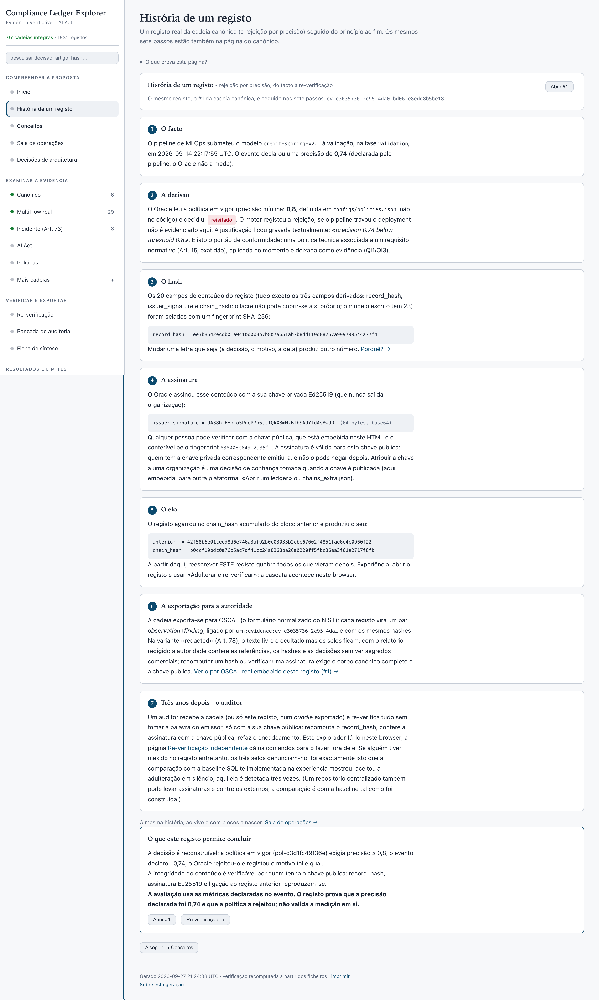

Abra «História de um registo». A página acompanha o registo #1 da cadeia canónica em sete passos. O símbolo `#1` indica a posição na cadeia; a numeração começa em `#0`.

Neste exemplo, o evento declarou uma precisão de 0,74. A política exigia pelo menos 0,80, pelo que o Oracle registou uma rejeição. Os passos seguintes mostram a política identificada, os valores conservados e os mecanismos de verificação.

O registo preserva o que o Oracle recebeu e declarou. A verificação criptográfica não confirma a exatidão da medição nem reexecuta automaticamente toda a política. Alguns dados do evento, como a aprovação humana, não constam do corpo do registo; uma reconstrução completa pode exigir o evento original e a política arquivada.

Em «Conceitos», encontra explicações de quatro termos usados nas outras páginas:

| Termo | Como ler no explorador |
|---|---|
| Hash | Valor calculado a partir de um conteúdo. Permite conferir se o conteúdo recebido reproduz o valor conservado. |
| Assinatura Ed25519 | Verificação de que o conteúdo corresponde a uma assinatura sob determinada chave pública. A atribuição dessa chave ao emissor exige uma referência de confiança. |
| Encadeamento | Ligação de cada registo ao anterior por hashes. Ordena os registos recebidos na cadeia. |
| Âncora | Hash final conservado como referência para comparar uma cadeia ou o seu prefixo. |

As analogias jurídicas da página «Conceitos» servem para explicar o funcionamento. Não atribuem às assinaturas do protótipo os efeitos de um ato notarial ou de um serviço qualificado.

«Decisões de arquitetura» apresenta seis decisões documentadas, conhecidas como ADRs, com as alternativas consideradas e as razões da escolha. Abra esta página para examinar a justificação do desenho técnico.

### Abrir os detalhes da história, dos conceitos e das ADRs

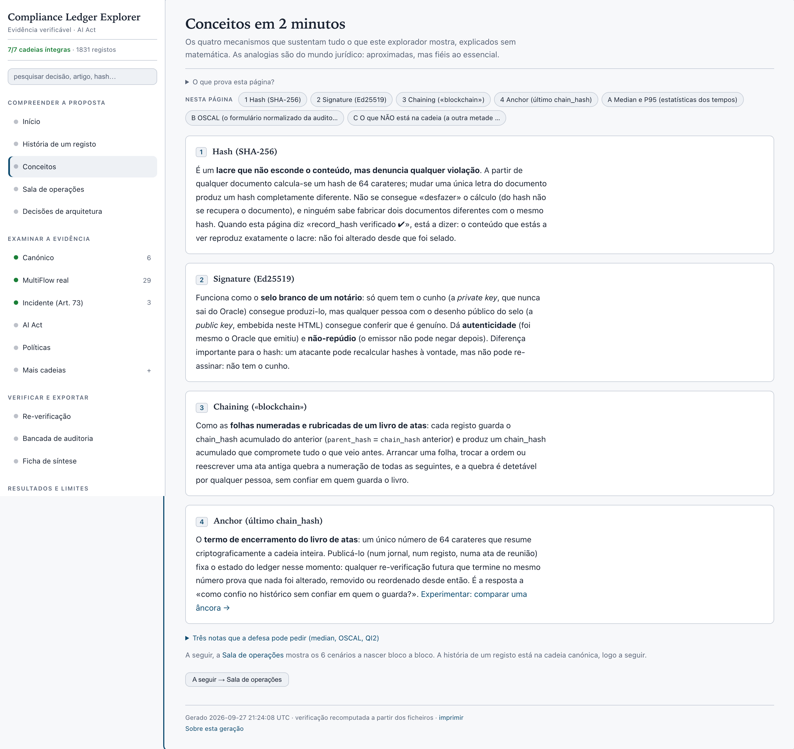

1. Na «História de um registo», percorra os sete passos. Clique em «Abrir #1» para confrontar a narrativa com o corpo do registo.
2. No passo OSCAL, clique na ligação ao par real embebido. O texto identifica a cadeia e a posição que vai abrir; no diálogo, desça e expanda «ver o OSCAL real deste registo».
3. Em «Conceitos», expanda «Três notas que a defesa pode pedir (median, OSCAL, QI2)». Ficam visíveis as explicações adicionais sobre a mediana, o relatório e a segunda pergunta de investigação.
4. No conceito de âncora, clique em «Experimentar: comparar uma âncora →». A página de Re-verificação permite repetir a comparação descrita na secção 7.

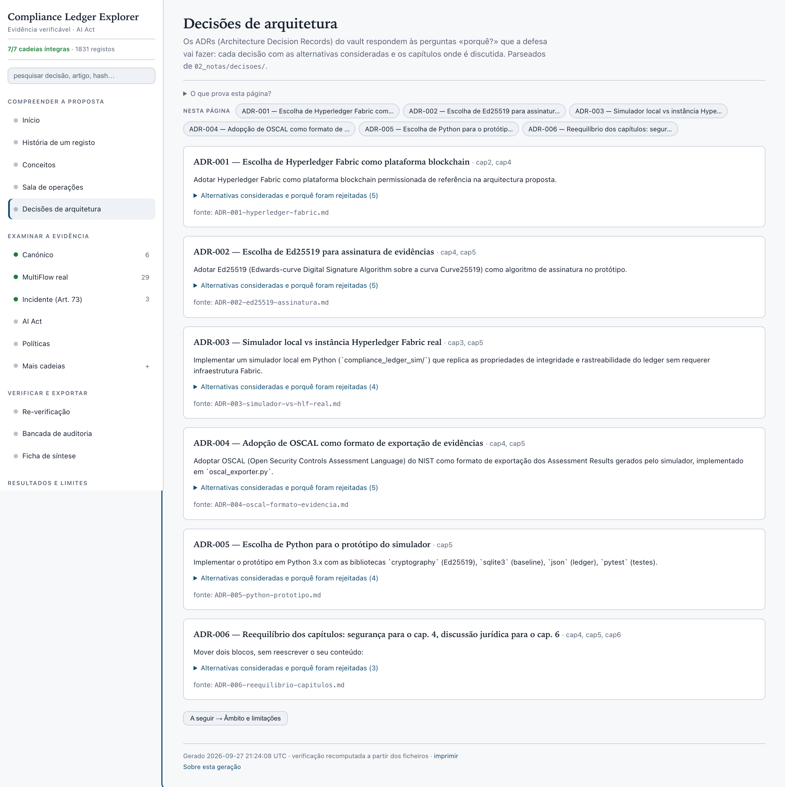

5. Abra «Decisões de arquitetura» e escolha uma ADR na barra «Nesta página», por exemplo ADR-001.
6. Clique em «Alternativas consideradas e porquê foram rejeitadas». Abre-se uma tabela com as alternativas e as razões de rejeição. O número entre parênteses indica quantas existem nessa ADR.
7. Repita a abertura nas outras cinco ADRs. Leia a decisão e os capítulos indicados acima de cada tabela; clicar numa ADR da barra superior apenas desloca a página.
8. Recolha a tabela pelo mesmo título ou use «A seguir → Âmbito e limitações».

## 4. Consultar cadeias e registos

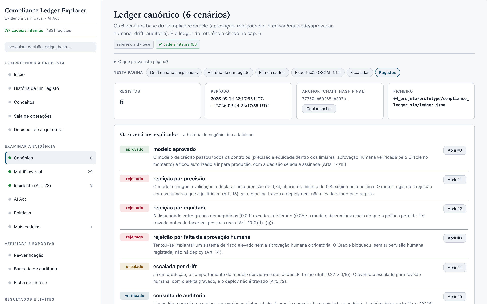

No cabeçalho, clique em «Copiar anchor» para conservar o `chain_hash` final. Os cartões apresentam o ficheiro de origem e o resultado da geração; o caminho do ficheiro é uma referência, não um carregamento automático. Nos seis cenários canónicos, «Abrir #…» abre o exemplo diretamente.

### Encontrar e filtrar registos

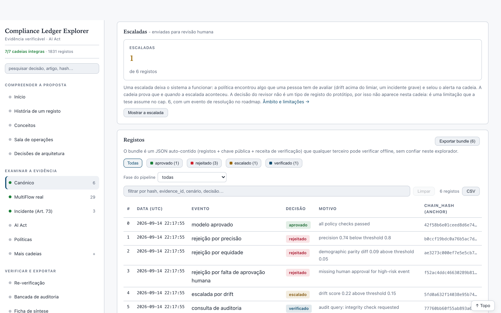

1. Abra «Canónico» no menu. O cabeçalho identifica a cadeia, o número de registos e a âncora final.
2. Na barra «Nesta página», selecione «Registos» para chegar à tabela.
3. Escolha uma decisão, como «rejeitado». Na cadeia canónica, este filtro mostra três registos.
4. Combine o filtro com a fase do pipeline, a sequência de etapas de processamento, ou com o campo de texto. Quando os dados abrangem vários dias, existem também filtros de data.
5. Selecione «Limpar» para voltar ao conjunto completo. Nas tabelas maiores, use os botões de paginação.
6. Clique numa linha para abrir o detalhe. Também pode selecionar um bloco na fita da cadeia.

Em «Mais cadeias», clique no nome do grupo para expandir os conjuntos complementares: [Steel](../Project/ledger_explorer/LEDGER_EXPLORER.html#multiflow_steel), [Fabric, medição de latência](../Project/ledger_explorer/LEDGER_EXPLORER.html#fabric_gateway), [Fabric, demonstração de encadeamento](../Project/ledger_explorer/LEDGER_EXPLORER.html#fabric_demo) e [primeira execução MultiFlow](../Project/ledger_explorer/LEDGER_EXPLORER.html#multiflow_smoke). Consulte a descrição para distinguir um ensaio de carga, uma medição e uma execução anterior.

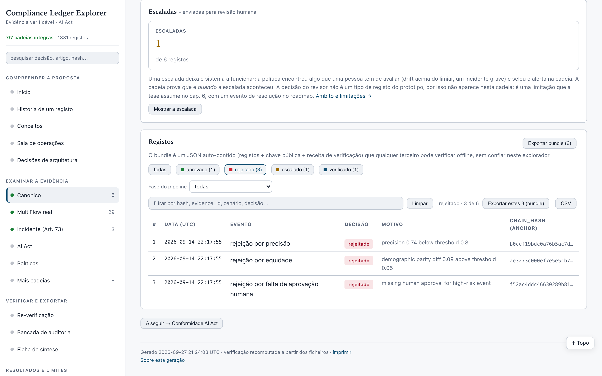

O filtro selecionado fica destacado. Clique de novo nessa decisão para a retirar, ou escolha «Todas». «Limpar» retira também o texto, a fase e as datas. O contador junto dos filtros mostra quantos registos correspondem à seleção. Os botões da paginação alteram apenas as linhas visíveis; o CSV e o bundle filtrado abrangem todas as linhas que satisfazem os filtros.

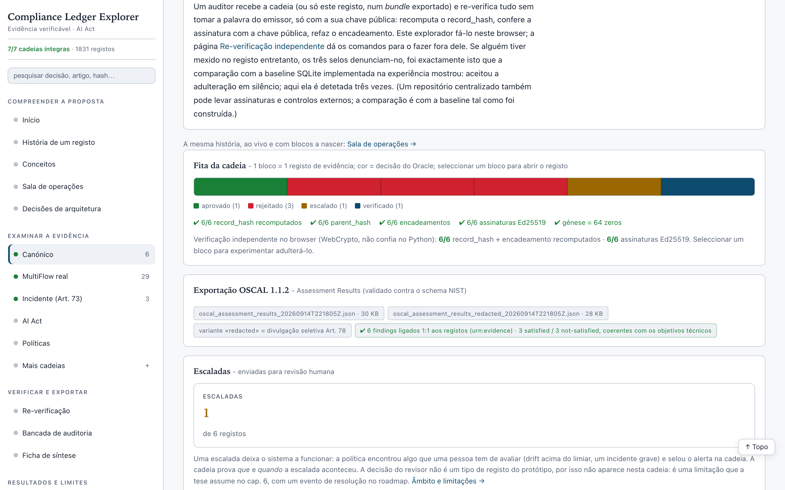

Na fita das cadeias curtas, passe o rato sobre um bloco para ler a posição, o evento e a decisão; clique para abrir o registo. Na Steel, a fita agrega decisões consecutivas e não abre registos individuais: use a tabela. A faixa abaixo distingue o resultado calculado na geração da verificação independente que este browser acaba de realizar. Aguarde a conclusão desta última e confira o número de assinaturas efetivamente verificadas.

Quando houver uma lista de problemas, clique em «registo #…» para abrir a posição afetada. No painel de escaladas, clique em «Mostrar a escalada» ou «Mostrar as … escaladas»: a tabela passa a mostrar essas decisões. Abra uma linha e, no fim, use «Limpar».

### Ler o detalhe

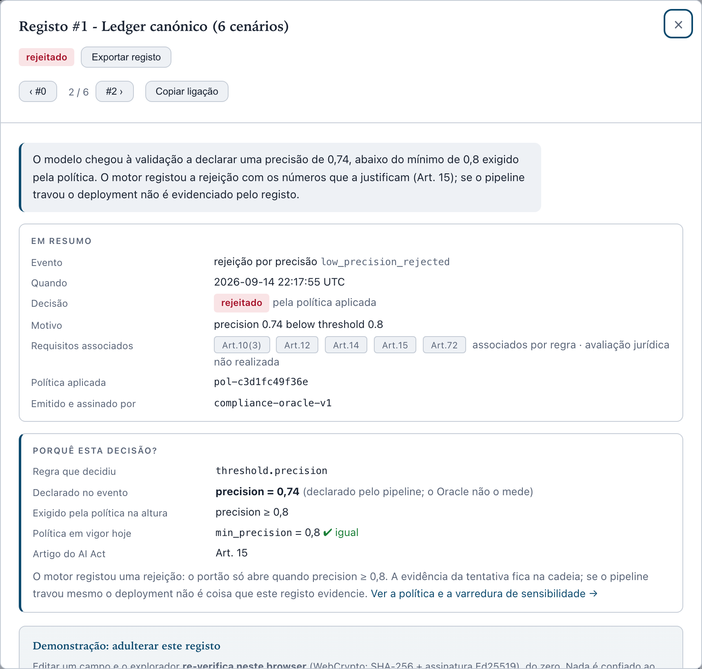

O diálogo começa por «Em resumo»: evento, data, decisão, motivo, requisitos associados, política e emissor. «Porquê esta decisão?» mostra a regra e os valores conservados. Compare a política aplicada no momento do registo com a política atualmente embebida quando ambas forem apresentadas.

Para abrir os detalhes recolhidos no diálogo:

1. Abra o #1 da cadeia canónica e leia «Em resumo». Desça dentro do diálogo até «Porquê esta decisão?»: compare a regra, o valor declarado, o limiar aplicado e a política hoje embebida. Este painel surge nos casos que o explorador consegue explicar a partir do motivo.
2. Desça até «Os 23 campos deste registo» e clique no triângulo ou no título. O corpo completo passa a estar visível. Localize `rule_id`, `metrics`, `policy_id`, `policy_hash` e os campos criptográficos.
3. Dentro desse conteúdo, clique em «O que significa cada campo?». Abre-se uma segunda lista com a definição de cada campo existente. Passe também o rato sobre o nome de um campo para ler a ajuda breve.
4. Clique num hash ou identificador longo que indique «seleccionar para copiar». A aplicação copia o valor completo. Os motivos, as métricas e os rótulos de artigos não usam esse comando.
5. Recolha os campos e expanda «ver o OSCAL real deste registo (observation + finding)», quando existir. Leia as duas estruturas e a ligação ao registo. O estado `satisfied` ou `not-satisfied` descreve o objetivo técnico indicado.
6. Clique novamente nos títulos para recolher as listas. Use `‹ #0` ou `#2 ›` no topo para comparar o anterior ou o seguinte.
7. Para conservar o exemplo, clique em «Exportar registo»; para conservar o destino, clique em «Copiar ligação». Feche com `×`.

O número do título dos campos depende do registo: execuções anteriores podem ter menos de 23. Nas cadeias longas, a mensagem de vista compacta explica por que razão não aparece o corpo completo nem a exportação individual.

OSCAL é o formato estruturado usado para organizar observações e resultados de avaliação. Os artigos em `requirements_covered` são associações feitas pelo Oracle com base nos campos do evento. A sua presença não significa que todas as regras desses artigos foram executadas ou que existe uma avaliação jurídica favorável.

Utilize `←` e `→` para passar entre registos. «Copiar ligação» conserva o destino, por exemplo `#canonico/1`. Uma ligação para um ficheiro local só funciona para quem também tenha uma cópia do explorador; nesse caso, abra a cópia e use o mesmo sufixo. Numa versão publicada, a ligação pode ser aberta no endereço partilhado.

### Demonstrar uma alteração

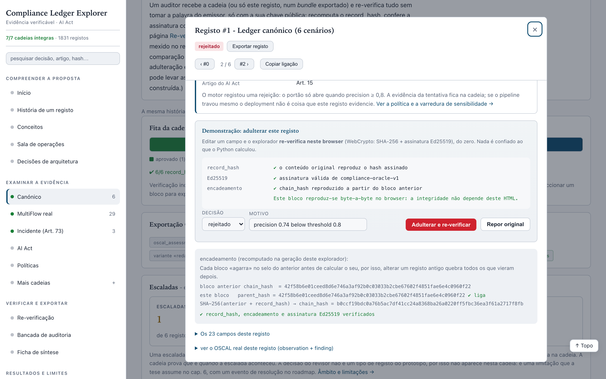

1. Abra um registo completo da cadeia canónica com a vista de auditor desligada.
2. Desça até «Demonstração: adulterar este registo». Antes de editar, leia os resultados do original: `record_hash`, Ed25519 e encadeamento.
3. Na caixa «Decisão», escolha outro valor, ou escreva um motivo diferente em «Motivo». Por exemplo, mude «rejeitado» para «aprovado» e conserve o resto.
4. Clique em «Adulterar e re-verificar». Leia a comparação entre o conteúdo original e a alteração, o hash recalculado, a assinatura, o `chain_hash` e, se existir, a ligação ao bloco seguinte.
5. Clique em «Repor original». Os campos e os controlos regressam ao estado do registo conservado. Feche com `×`.

O exercício altera uma cópia em memória. A aplicação conserva os registos originais. Neste exercício, a alteração do corpo faz falhar a recomputação e a assinatura; outras alterações podem afetar controlos diferentes. Leia cada resultado separadamente.

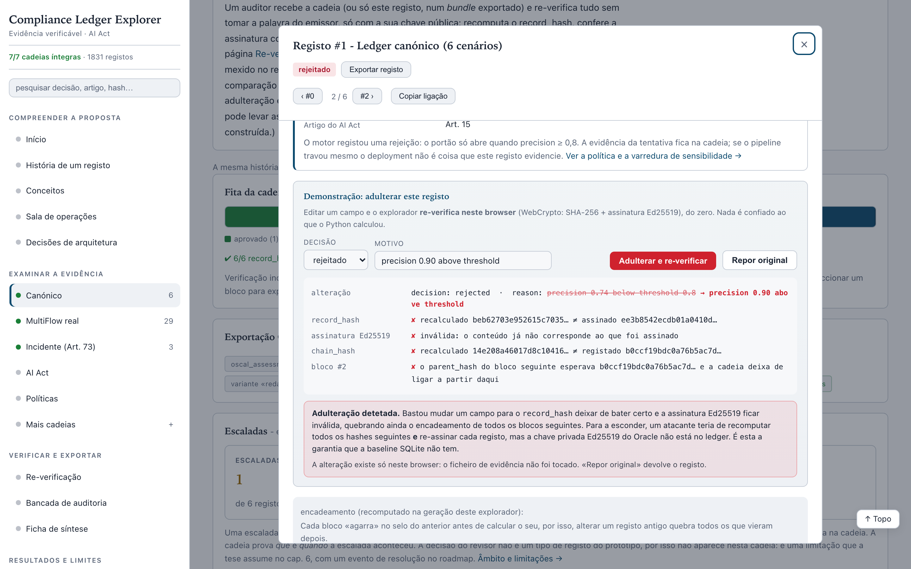

A imagem mostra uma alteração do motivo e as falhas correspondentes. O painel de encadeamento situado mais abaixo continua a descrever o original verificado na geração; o resultado da experiência está no painel da adulteração.

## 5. Explorar as demonstrações e as políticas

### Sala de operações

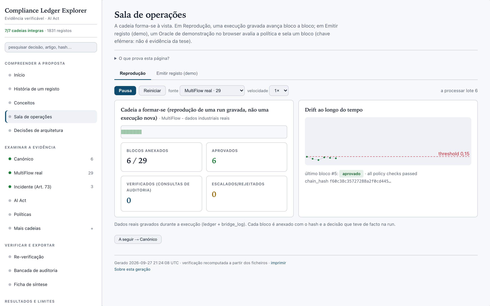

1. Abra «Sala de operações» e clique no separador «Reprodução».
2. Abra o seletor «Fonte» e escolha Canónico ou MultiFlow real. A mudança de fonte reinicia a apresentação dessa execução.
3. Escolha a velocidade `1×`, `2×`, `4×` ou `8×`. Clique em «Reproduzir» e observe a fita e os contadores.
4. Clique em «Pausa» para parar num momento; «Retomar» continua a reprodução.
5. Clique num bloco já visível na fita para abrir o registo original da cadeia de origem. Leia os detalhes e feche com `×`.
6. Consulte a última decisão e o gráfico de deriva, quando a fonte dispõe dessa série. Se aparecer o botão para reproduzir MultiFlow, clique para mudar para essa fonte.
7. Clique em «Reiniciar» para regressar ao início. Pode então repetir mais devagar.

A reprodução não recolhe novos dados nem liga o browser a uma instalação industrial.

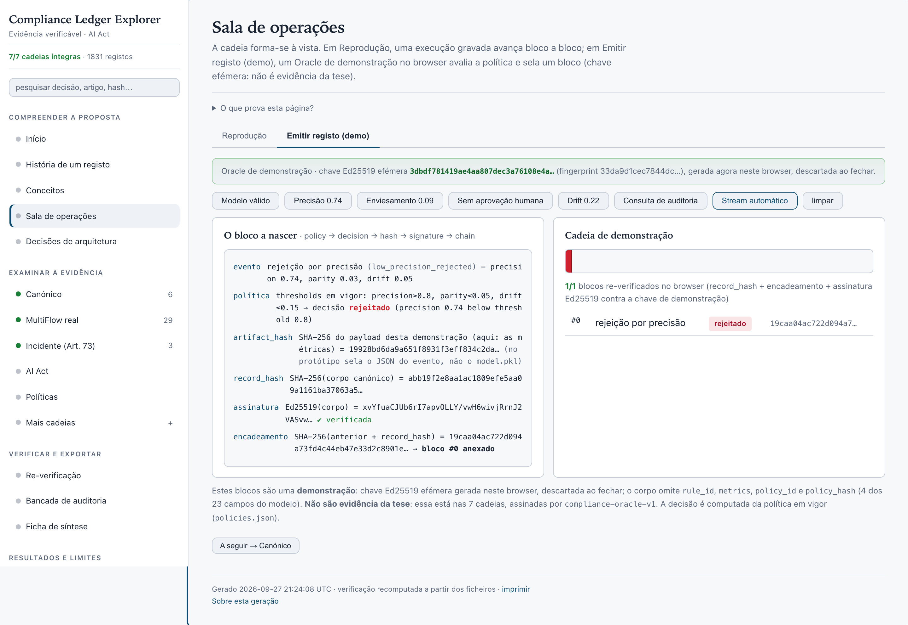

Para experimentar a emissão, selecione «Emitir registo (demo)» e escolha um dos eventos disponíveis. O Oracle de demonstração calcula a decisão e mostra as fases de construção do registo. Pode repetir o exercício com outro evento. «Stream automático» inicia a emissão em sequência e passa a chamar-se «Parar stream»; clique nesse botão para parar. O botão «limpar» remove os registos de demonstração desta sessão.

Estes registos usam uma chave efémera gerada no browser e desaparecem ao terminar a sessão. O seu formato omite quatro campos do modelo completo: `rule_id`, `metrics`, `policy_id` e `policy_hash`. Leia-os como demonstração do mecanismo; não entram nos resultados da dissertação.

Para abrir o registo acabado de emitir, clique na sua linha na tabela da demonstração. Surge «Bloco de demonstração #…», com os campos efetivamente presentes. Desça e expanda «O que significa cada campo?» para consultar as definições; a lista de ajuda inclui campos do modelo que esta demonstração pode omitir. Feche com `×` antes de emitir outro evento. «limpar» reinicia também a chave efémera, pelo que a sequência seguinte constitui outra demonstração.

### MultiFlow

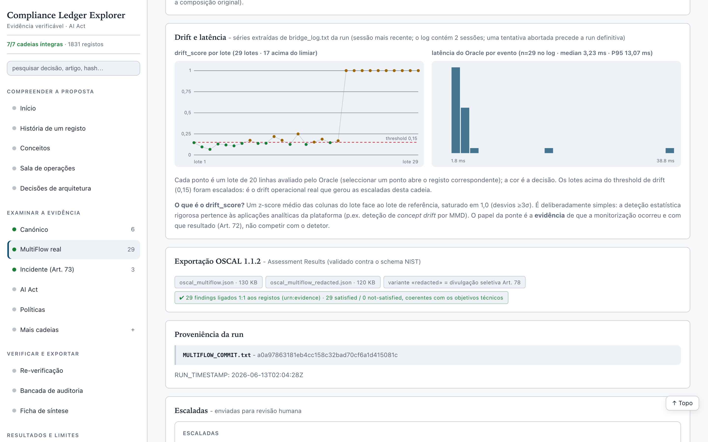

1. Abra «MultiFlow real» e use «Nesta página» para chegar aos gráficos de deriva e de latência.
2. No gráfico de deriva, passe o rato sobre um ponto: aparecem o lote, o valor, a decisão e a posição do registo.
3. Clique nesse ponto para abrir o registo correspondente. Desça até aos campos para confrontar a métrica com o motivo. Feche com `×`.
4. No histograma de latência, passe o rato sobre uma barra para ler o intervalo em milissegundos e o número de eventos. Este gráfico não abre registos por clique.
5. No painel de escaladas, clique em «Mostrar as … escaladas», abra uma linha e confira o motivo. Use «Limpar» para voltar aos 29 registos.
6. Consulte o painel da ponte para perceber a origem dos valores e o alcance da integração. Os seus blocos explicativos não são comandos de operação.

A deriva, identificada como `drift_score`, mede diferenças dos dados face a um lote de referência. A ponte calculou esse indicador; a precisão e a diferença de paridade demográfica entre grupos foram fornecidas pela configuração. Os dados industriais foram reproduzidos na experiência. O mecanismo observa e regista decisões; esta demonstração não comprova o bloqueio de uma implantação nem a intervenção posterior de um supervisor.

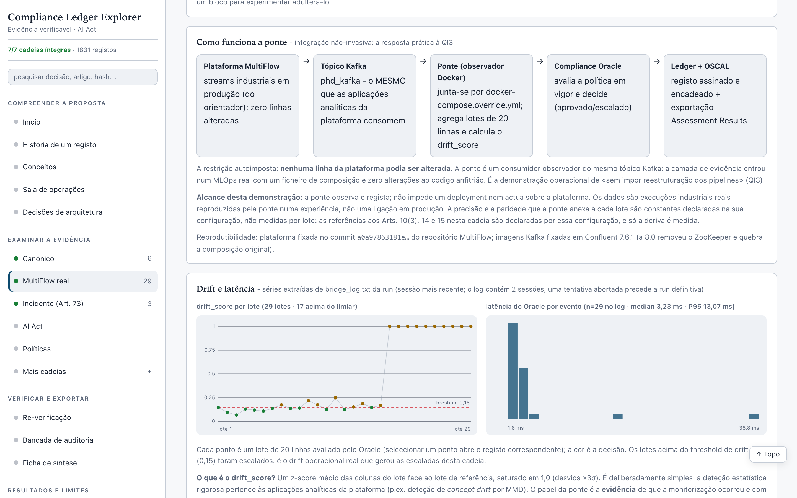

### Políticas e sensibilidade

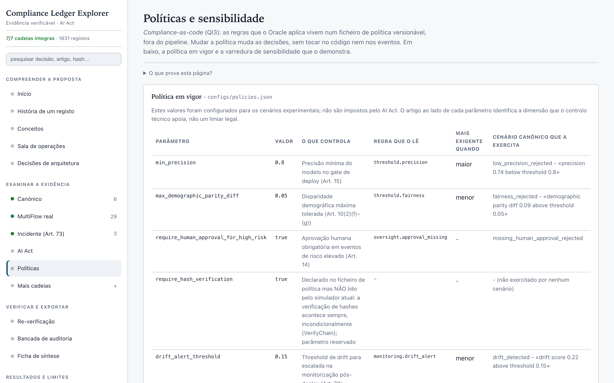

Em «Políticas», consulte cada parâmetro, a regra que o usa e o cenário que o exercita. Os limiares foram escolhidos para as experiências. A tabela não os apresenta como valores impostos pelo AI Act.

### Abrir uma combinação de limiares

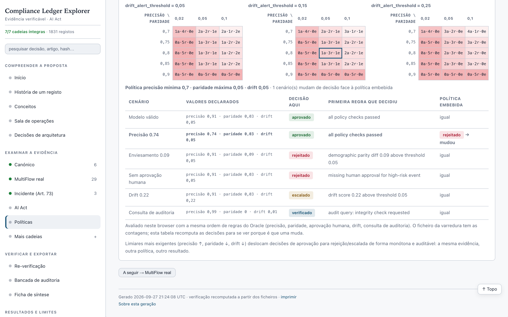

1. Em «Políticas», desça até «Análise de sensibilidade». Existem três grelhas, uma por limiar de deriva.
2. Passe o rato sobre uma célula para ler os três limiares e as contagens. A linha corresponde à precisão mínima; a coluna, à paridade máxima.
3. Na grelha `drift_alert_threshold = 0,05`, clique na célula da linha `0,7` e da coluna `0,05`. Também pode selecioná-la com `Tab` e abrir com `Enter`.
4. Leia a tabela que aparece por baixo das grelhas. Mostra os seis cenários, os valores declarados, a decisão com essa combinação, a primeira regra e a comparação com a política embebida. Nesse exemplo, a precisão de 0,74 deixa de ser rejeitada pelo limiar de 0,80.
5. Clique na célula destacada da política embebida, com precisão `0,8`, paridade `0,05` e deriva `0,15`, para ler a referência.
6. Selecione outra combinação e observe as linhas que mudam. A nova seleção substitui o detalhe anterior; as linhas da tabela são de leitura.

As contagens das grelhas vêm da experiência preservada. O detalhe dos seis cenários é recalculado neste browser. A cor resume a taxa de rejeição; para perceber uma decisão, leia a regra apresentada.

O motor termina na primeira regra aplicável. Um controlo anterior pode decidir antes de um alerta de deriva. A seleção de uma célula avalia essa combinação apenas na demonstração e não altera a política do protótipo.

### Expandir o histórico da política

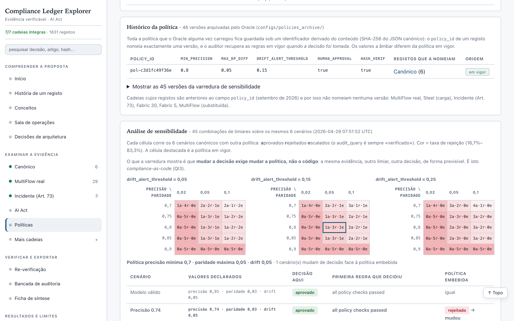

1. Em «Políticas», desça até «Histórico da política». A linha inicial identifica a política em vigor e os registos que a nomeiam.
2. Passe o rato sobre `policy_id` para ler o `policy_hash` completo na ajuda. Esse campo não abre um editor da política.
3. Clique em «Canónico (6)», na coluna «Registos que a nomeiam», para abrir a cadeia associada. Abra um registo e compare o seu `policy_id` com a linha do histórico.
4. Regresse a «Políticas» e clique em «Mostrar as 45 versões da varredura de sensibilidade». Aparece a tabela das versões, com os limiares e a origem de cada uma.
5. Compare os valores a âmbar com a política em vigor. Leia os avisos de cadeias anteriores à introdução de `policy_id`; esses registos não identificam a versão por esse campo.
6. Clique novamente no título para recolher as 45 versões. O histórico tem 46 versões nesta geração.

## 6. Examinar o enquadramento e os resultados

### Abrir a evidência de um artigo

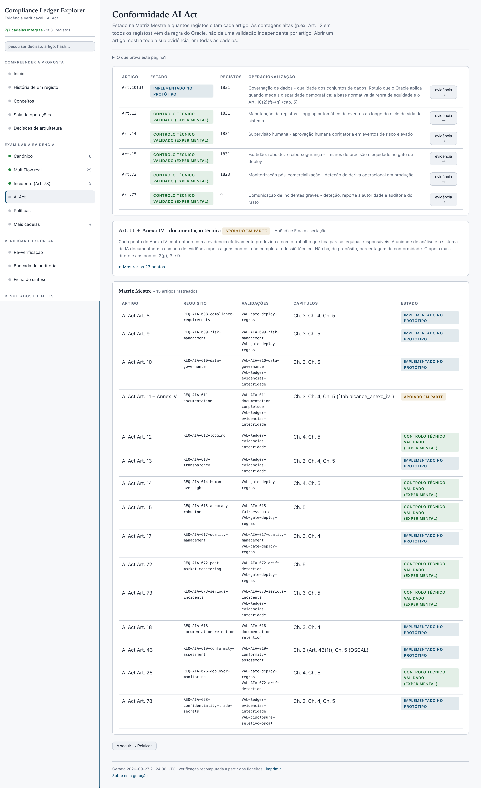

1. Abra «AI Act». Na primeira tabela, localize o artigo 15.º e clique em «evidência →».
2. Na página do artigo, leia o estado e a explicação. Em «Um caso, de ponta a ponta», clique na caixa da regra ou do valor/limiar: abre «Políticas». Regresse ao artigo pelo menu AI Act e pelo botão de evidência.
3. Clique na caixa da decisão e posição, como «rejeitado #1»: abre o registo. A caixa «verificar» abre o mesmo registo e leva à demonstração de adulteração.
4. Clique na caixa de validação para consultar «Custo e adulteração». As caixas do artigo e do requisito apresentam referências; não abrem uma avaliação jurídica.
5. Na secção «Rastreabilidade», leia os requisitos, as validações, os capítulos e o estado. Esses identificadores conservam a ligação documental e não carregam os capítulos no browser.
6. Desça às tabelas de evidência por cadeia. Clique numa linha para abrir o registo. «Exportar … em bundle» descarrega os registos dessa cadeia que citam o artigo, quando a exportação completa está disponível.
7. Expanda «Mais … em cadeias de anexo (carga, medição, smoke)» para incluir as tabelas que estavam recolhidas.
8. Clique em «Abrir a cadeia filtrada por este artigo →». A tabela da cadeia abre com o artigo como filtro; use «Limpar» para regressar a todos os registos.
9. Para escolher outro artigo, volte a «AI Act» e use «← Todos os artigos» se estiver na página de um artigo.

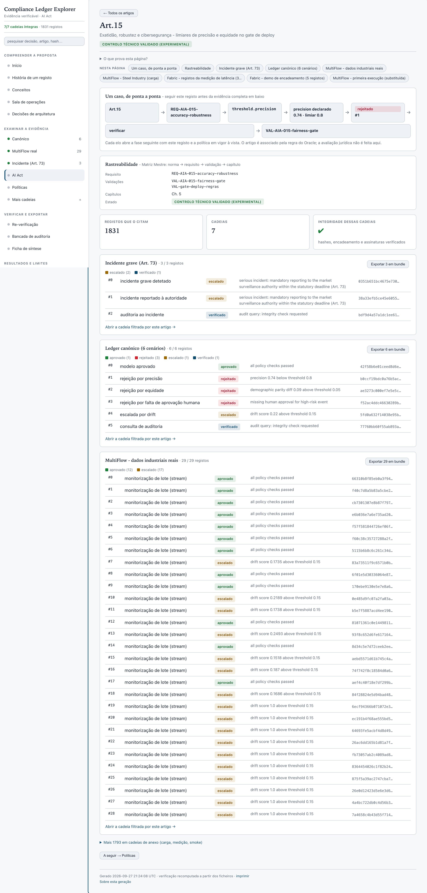

Na página «AI Act», escolha «Evidência →» num artigo. O percurso liga o artigo ao requisito, à regra técnica, ao registo e à validação. Consulte os capítulos indicados para confrontar a interpretação com a dissertação.

O estado da Matriz Mestre descreve o suporte técnico disponível: validado experimentalmente, implementado ou apoiado em parte. Não equivale a uma declaração de conformidade. O painel do artigo 11.º e do Anexo IV distingue a evidência disponível da documentação que continua necessária.

### Expandir os 23 pontos do Anexo IV

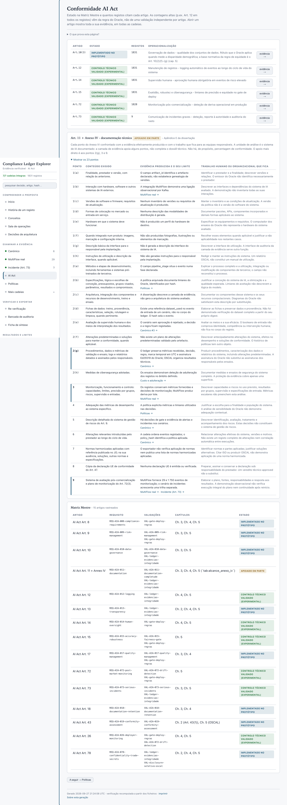

1. Na página inicial «AI Act», localize «Art. 11 + Anexo IV - documentação técnica».
2. Clique em «Mostrar os 23 pontos». Aparece a tabela com o conteúdo exigido, a evidência e o limite, e o trabalho humano ou organizacional ainda necessário.
3. Percorra a coluna de evidência. Quando houver uma ligação, clique em «Canónico», «Canónico #3», «MultiFlow real», «Políticas», «Custo e adulteração» ou «Incidente (Art. 73)», conforme o ponto. A ligação abre a página ou o registo indicado.
4. Regresse a «AI Act» e reabra «Mostrar os 23 pontos» se o painel tiver sido recolhido pela mudança de página.
5. Desça à «Matriz Mestre» para comparar o requisito, a validação e os capítulos de cada artigo. Esta tabela é de consulta; a contagem de registos está na tabela de artigos.
6. Clique novamente em «Mostrar os 23 pontos» para recolher o painel.

As referências a outras leis, quando existirem num ledger carregado, surgem no painel «Outras leis referidas na evidência». Clique em «evidência →» nessa tabela. A página identifica a lei e apresenta os registos que transportam a referência, acompanhados da indicação de que ficam fora da Matriz Mestre da dissertação.

As restantes páginas permitem examinar experiências específicas:

| Página | Como utilizar e interpretar |
|---|---|
| Incidente (Art. 73) | Siga a sequência deteção → reporte simulado → consulta e leia os intervalos entre os registos. A experiência não envia uma comunicação real à autoridade. |
| Custo e adulteração | Consulte o protocolo, as duas execuções locais e a dispersão dos resultados. Os tempos comparam caminhos completos; não isolam o custo da criptografia. |
| Rede Fabric | Examine a topologia e os artefactos preservados. Distinga consulta/verificação de submissão até commit, a confirmação da gravação na rede. Abrir esta página não inicia uma rede Fabric. |
| Âmbito e limitações | Consulte o alcance demonstrado e os capítulos que discutem as limitações. Use esta página ao avaliar uma afirmação feita numa apresentação. |

A integridade de um registo não demonstra a verdade das métricas, a linhagem completa de um modelo ou o cumprimento integral de uma obrigação legal. O encadeamento ordena os eventos conservados. Para relacionar essa ordem com versões de dados, treino e utilização, é necessária evidência adicional.

### Abrir os três momentos do incidente

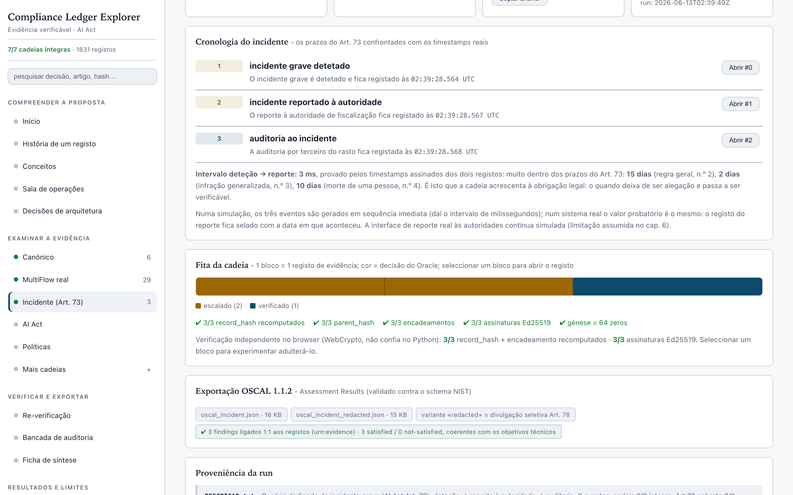

1. Abra «Incidente (Art. 73)» e chegue à cronologia pela barra «Nesta página».
2. Clique em «Abrir #…» no momento da deteção. Leia o evento, o tempo indicado e a decisão; feche com `×`.
3. Repita no reporte simulado e na consulta de auditoria. Compare os três tempos com os intervalos apresentados na cronologia.
4. Consulte a fita e a verificação no browser. Use «Registos» para ver os três momentos na tabela e o detalhe de cada um.
5. Para examinar a associação normativa, abra «AI Act» e a evidência do artigo 73.º.

A cronologia é calculada dos tempos conservados. A consulta permite conferir o ensaio, incluindo os prazos que a página apresenta, sem enviar um reporte.

### Consultar custo, dispersão e adulteração

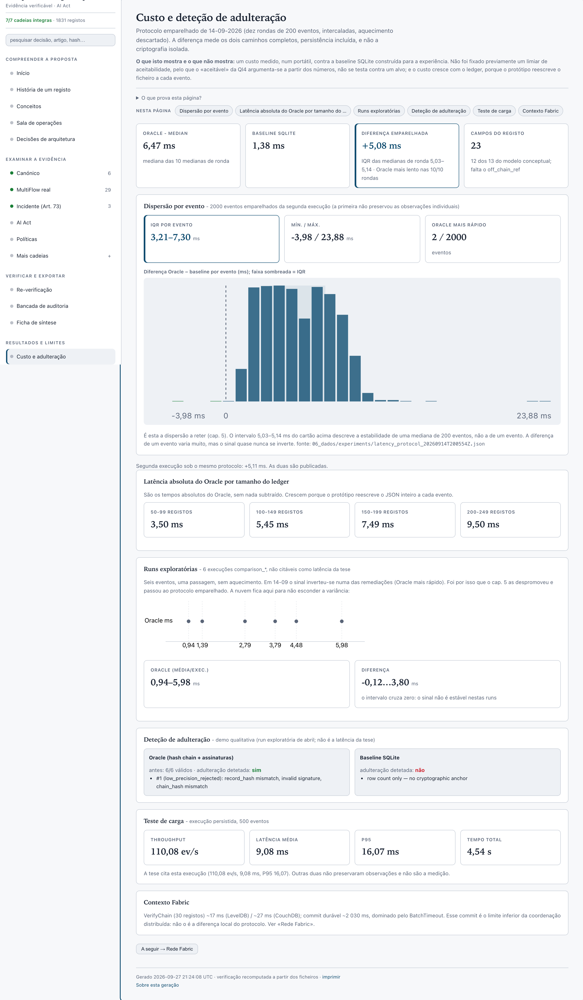

1. Abra «Custo e adulteração» e expanda «O que prova esta página?». Leia o protocolo e o âmbito da medição.
2. Na barra «Nesta página», escolha «Dispersão por evento». Passe o rato sobre uma barra do histograma para ver o intervalo de diferença e a quantidade de eventos.
3. Escolha «Latência absoluta do Oracle por tamanho do ledger» para comparar o custo conforme o ficheiro cresce. Os cartões são valores de consulta.
4. Em «Runs exploratórias», passe o rato sobre um ponto para ler a execução, o tempo do Oracle e a diferença. Esses pontos não abrem registos.
5. Escolha «Deteção de adulteração». Compare a lista de falhas do Oracle com a baseline. Este painel conserva o resultado de uma experiência; para alterar uma cópia, abra o registo canónico #1, como na secção 4.
6. Consulte «Teste de carga» e «Contexto Fabric». Para examinar as medições distribuídas, escolha «Rede Fabric» no menu.

### Abrir a proveniência das medições Fabric

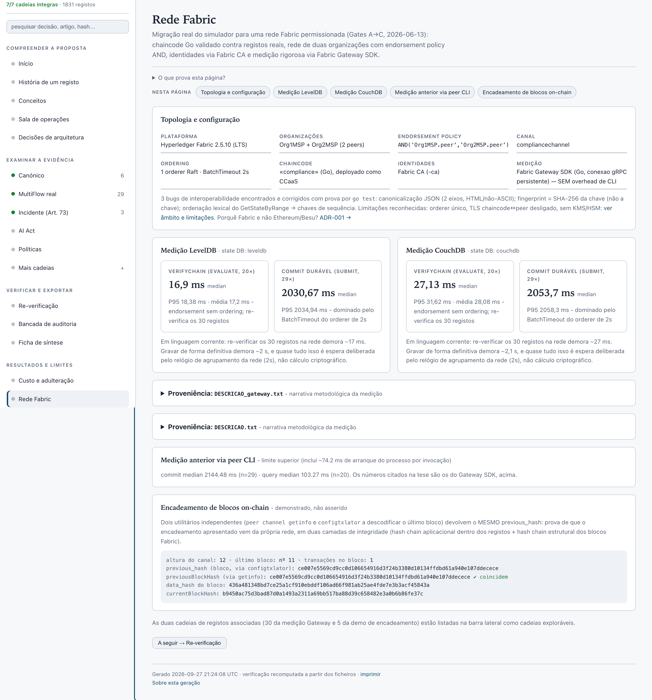

1. Abra «Rede Fabric» e use «Nesta página» para chegar à topologia ou às medições LevelDB e CouchDB. Compare a verificação com a submissão até commit.
2. Clique em «Proveniência: DESCRICAO_gateway.txt». Abre-se a narrativa metodológica conservada. Clique no mesmo título para a recolher.
3. Abra também «Proveniência: DESCRICAO.txt» para ler a narrativa da outra medição. Não é necessário executar os comandos eventualmente citados nessa narrativa.
4. Escolha «Encadeamento de blocos on-chain». Compare os dois valores `previous_hash` e a indicação de correspondência. O painel apresenta o resultado preservado; não interroga uma rede nesta sessão.
5. Na nota da topologia, clique em «ADR-001 →» para consultar a escolha da plataforma; em «ver âmbito e limitações», para examinar as restrições.
6. No menu «Mais cadeias», abra Fabric 30 ou Fabric 5 e use a tabela, a fita e o detalhe para examinar os registos associados.

### Consultar as limitações

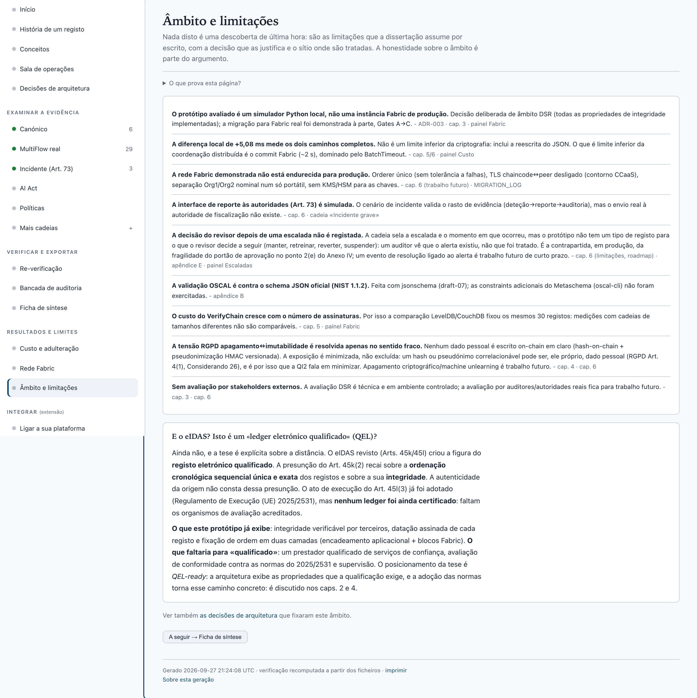

Abra «Âmbito e limitações» e percorra os painéis. Leia o capítulo indicado em cada limitação; a referência ao capítulo não abre a dissertação. No fim, clique em «as decisões de arquitetura» para confrontar uma restrição com a decisão que fixou o desenho.

## 7. Re-verificar no browser

### Comparar uma âncora

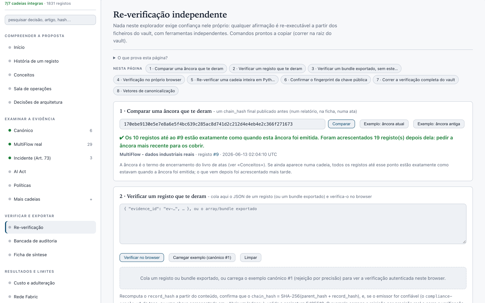

1. Abra «Re-verificação» e localize «Comparar uma âncora que te deram».
2. Cole o `chain_hash` recebido por uma fonte de confiança e selecione «Comparar».
3. Leia se corresponde à âncora atual, a uma âncora anterior, a uma cadeia com problemas ou a um valor desconhecido.
4. Para aprender a diferença, experimente os botões «Exemplo: âncora atual» e «Exemplo: âncora antiga».

Uma âncora anterior cobre apenas o prefixo que termina nesse registo. Conserve a referência fora do pacote a verificar: substituir a cadeia e a sua própria referência em conjunto retira à comparação esse ponto de confiança. Eventos que nunca foram recebidos exigem reconciliação com a fonte de emissão.

Os botões dos exemplos preenchem a caixa e comparam de imediato. No resultado, clique em «#…» para abrir o registo onde a âncora foi encontrada. Se colar um `record_hash` em vez de um `chain_hash`, a página explica a diferença e oferece «abrir →» para esse registo. Feche o detalhe com `×` antes de colar outro valor.

### Verificar um registo ou um bundle

Um bundle reúne registos, chaves públicas e instruções de verificação num ficheiro JSON, um formato de texto estruturado por campos. Pode verificá-lo no browser sem executar as instruções técnicas incluídas no ficheiro.

1. Na mesma página, localize «Verificar um registo que te deram».
2. Cole o JSON de um registo, de uma lista de registos ou de um bundle.
3. Selecione «Verificar no browser». Para uma primeira experiência, use «Carregar exemplo (canónico #1)».
4. Leia as colunas `record_hash`, `chain_hash`, ligação ao anterior e assinatura.

5. Observe o resumo acima da tabela e leia as mensagens de campos inválidos, chave desconhecida ou assinatura indisponível. A indicação `n/d` significa que esse controlo não pôde ser concluído.
6. Para repetir a experiência, substitua o JSON e clique de novo em «Verificar no browser». «Limpar» esvazia a caixa e o resultado.

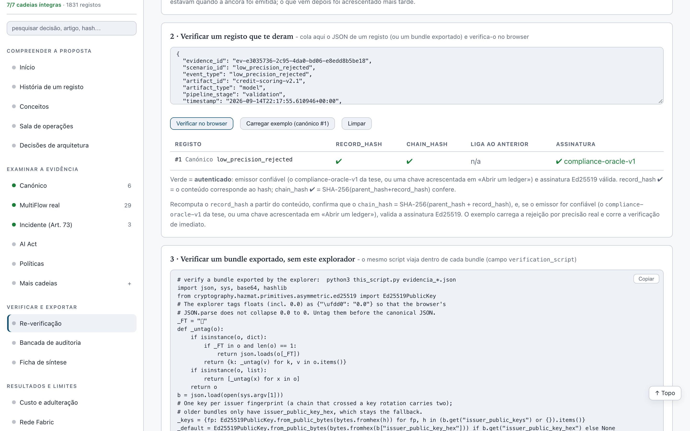

Um registo isolado não permite conferir a ligação ao antecessor ausente. Num subconjunto com posições identificadas, a ligação só é conferida entre vizinhos consecutivos. Uma marca verde indica assinatura válida sob uma chave reconhecida; `✔¹` a cinzento indica hashes consistentes sem autenticação por uma chave de confiança.

A chave do protótipo é de demonstração; o projeto inclui a chave privada correspondente. Por isso, a assinatura não identifica, por si só, quem emitiu o registo. Para verificar um emissor externo, obtenha a sua chave pública por um canal de confiança e indique-a em «Abrir um ledger».

Na barra «Nesta página», escolha «Verificação no próprio browser» para consultar o suporte exigido e «Vetores de canonicalização» para ler a conferência automática dos 19 exemplos. Aguarde o fim da recomputação. O resultado informa quantos foram reproduzidos e identifica divergências, se as houver.

Os painéis de código são referências técnicas. O botão de copiar copia o texto e não o executa. Para realizar as tarefas deste manual, utilize a comparação, o JSON colado e a bancada de auditoria, que funcionam no browser.

## 8. Criar e reconferir um papel de trabalho

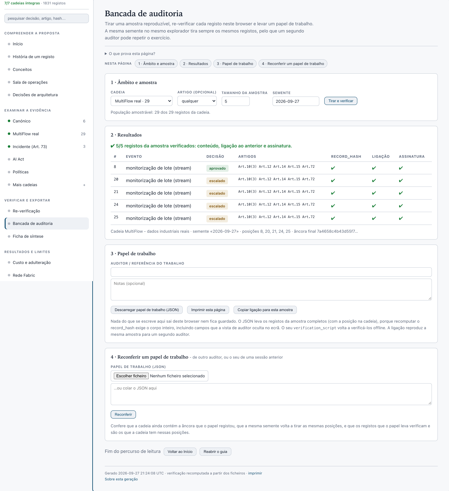

A «Bancada de auditoria» permite repetir a seleção de registos. A semente é um texto que determina a amostra; com os mesmos dados, parâmetros e versão do explorador, produz as mesmas posições.

1. Escolha a cadeia e, se necessário, um artigo.
2. Defina o tamanho da amostra e escreva uma semente, por exemplo `revisao-2026-10-03`.
3. Selecione «Tirar e verificar».
4. Leia o âmbito e os resultados de conteúdo, ligação e assinatura. Clique num registo para o examinar.
5. Preencha «Auditor / referência do trabalho» e as notas que pretenda conservar.
6. Selecione «Descarregar papel de trabalho (JSON)». Pode também imprimir a página ou copiar a ligação para a amostra.

Na cadeia Steel, a amostra é retirada dos 62 registos completos disponíveis no HTML, não de todos os 1 750 registos. A bancada identifica essa população. Não extrapole o resultado da amostra para uma verificação integral realizada nesta sessão.

### Examinar os resultados e os comandos de conservação

1. No painel «Resultados», confira a cadeia, a semente e as posições conservadas na nota abaixo da tabela. Compare separadamente o hash, a ligação e a assinatura de cada linha.
2. Clique numa linha, ou selecione-a com `Tab` e prima `Enter`, para abrir o detalhe. Desça aos campos e ao OSCAL quando existir. Feche com `×` para regressar à amostra. Na Steel, esse diálogo continua a apresentar o registo compacto; o papel de trabalho conserva o registo completo usado na verificação.
3. Em «Auditor / referência do trabalho», escreva a identificação da revisão e preencha «Notas (opcional)». Esses textos entram no papel de trabalho.
4. Clique em «Descarregar papel de trabalho (JSON)». O comando só fica disponível depois de tirar uma amostra.
5. Clique em «Copiar ligação para esta amostra» para conservar cadeia, tamanho, artigo e semente. Leia o âmbito indicado junto do botão.
6. Clique em «Imprimir esta página». Reveja a pré-visualização do browser e escolha imprimir ou guardar como PDF.
7. Se mudar a cadeia, o artigo, o tamanho ou a semente, clique novamente em «Tirar e verificar» antes de conservar o novo resultado.

Para repetir o trabalho de outra pessoa, vá a «Reconferir um papel de trabalho» e escolha o ficheiro JSON. A escolha do ficheiro inicia a reconferência. Em alternativa, cole o conteúdo e selecione «Reconferir». O explorador compara a cadeia e a âncora, repete a seleção pela semente e confronta os registos com a tabela de resultados.

Uma cadeia externa tem de estar aberta para essa comparação. Numa nova sessão, carregue os ficheiros pela mesma ordem e indique as chaves públicas: os identificadores locais dependem da sequência de aberturas. Se fechou e reabriu uma cadeia na mesma sessão, o identificador pode ter mudado. Nesse caso, recomece num novo separador, pela ordem original.

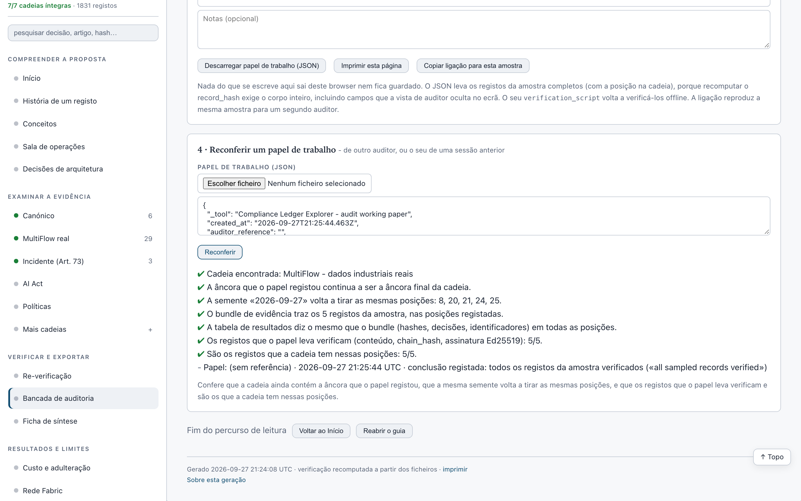

Na reconferência, percorra os controlos apresentados: identificação da cadeia, âncora, semente/posições, coerência do bundle e tabela de resultados. Leia também a nova verificação criptográfica. Para reconferir por texto, selecione todo o conteúdo da caixa, substitua-o e clique em «Reconferir». A escolha de outro ficheiro inicia a operação automaticamente. Uma coincidência de parâmetros não substitui a conferência dos registos.

O papel de trabalho contém os campos completos dos registos da amostra, mesmo com a vista de auditor ligada. Reveja o conteúdo antes de o partilhar. A ligação reproduz a seleção; não transporta os seus ficheiros locais, notas ou chaves de confiança adicionadas à sessão. Para uma cadeia externa, o destinatário precisa também de a carregar na mesma posição da sequência de aberturas.

## 9. Exportar e conservar resultados

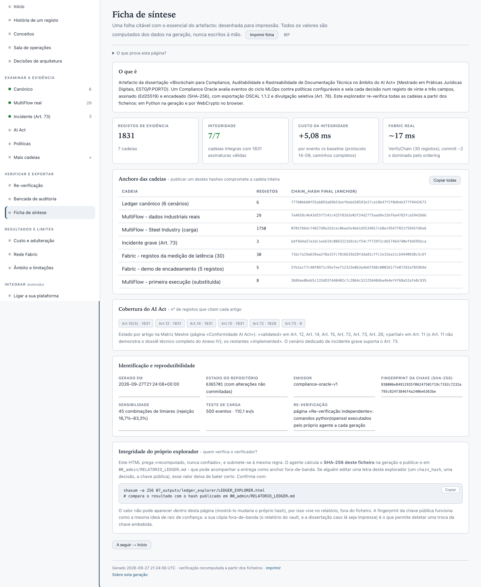

Escolha a exportação segundo o que pretende conservar:

| Comando | Conteúdo e utilização |
|---|---|
| «Exportar bundle» numa cadeia curta | Registos completos da cadeia, chaves públicas e receita de verificação. Os filtros da tabela não reduzem esta exportação. |
| «Exportar estes N (bundle)» | Subconjunto que corresponde aos filtros ativos, com as posições de origem. Surge quando esse tipo de exportação está disponível. |
| «Exportar registo» no detalhe | Registo completo selecionado. A sua verificação isolada não demonstra a completude da cadeia. |
| «CSV» | Texto organizado em linhas e colunas para análise em folha de cálculo, com os filtros aplicados. Não é um substituto do bundle verificável. |
| «Descarregar papel de trabalho (JSON)» | Âmbito, semente, posições, notas, resultados e registos completos da amostra. |
| «Imprimir ficha» | Síntese das cadeias, âncoras e resultados calculados durante a geração. No diálogo do browser, pode guardar como PDF. |

Na cadeia longa embebida, os botões de bundle integral e de exportação de um registo compacto não estão disponíveis. Use a bancada para conservar uma amostra completa ou abra o ledger integral recebido em «Abrir um ledger».

Os downloads ficam na pasta escolhida ou configurada no browser. Conserve o JSON original se precisar de repetir a verificação. Alterar a apresentação num CSV não altera o ledger, mas esse CSV não contém todo o corpo necessário à recomputação.

### Exportar a cadeia inteira e o subconjunto filtrado

1. Em «Canónico» → «Registos», clique em «Limpar» e depois em «Exportar bundle (6)». O ficheiro reúne os seis registos.
2. Clique em «rejeitado». Surge «Exportar estes 3 (bundle)»: clique para descarregar apenas as três rejeições, com as posições de origem.
3. Clique em «CSV» enquanto o filtro está ativo. O ficheiro conserva a seleção de três registos; o botão «Exportar bundle (6)» continua a exportar a cadeia inteira.
4. Abra uma das linhas e clique em «Exportar registo» para descarregar só esse registo.
5. Para verificar o que acabou de descarregar, abra o JSON num separador do browser ou num visualizador de texto e copie-o para «Re-verificação». Uma lista ou bundle também pode ser carregada diretamente em «Abrir um ledger».
6. Regresse à cadeia e selecione «Limpar» antes de começar outra consulta.

### Copiar âncoras e imprimir a ficha

1. Abra «Ficha de síntese» e chegue a «Anchors das cadeias».
2. Clique no hash final de uma linha para copiar essa âncora, ou em «Copiar todas» para copiar o conjunto.
3. Clique em «Imprimir ficha». No diálogo do browser, confira a escala e as páginas e escolha imprimir ou guardar como PDF.
4. Conserve a data de geração juntamente com a ficha. Os números da ficha descrevem as cadeias da dissertação; os ficheiros que abriu nesta sessão não entram nesses totais.

Os nomes de exportações OSCAL apresentados nas páginas das cadeias identificam os artefactos de origem. Não os trate como botões de download: para descarregar os registos use os comandos acima; para consultar um par OSCAL use o detalhe do registo.

## 10. Abrir ficheiros de outra plataforma

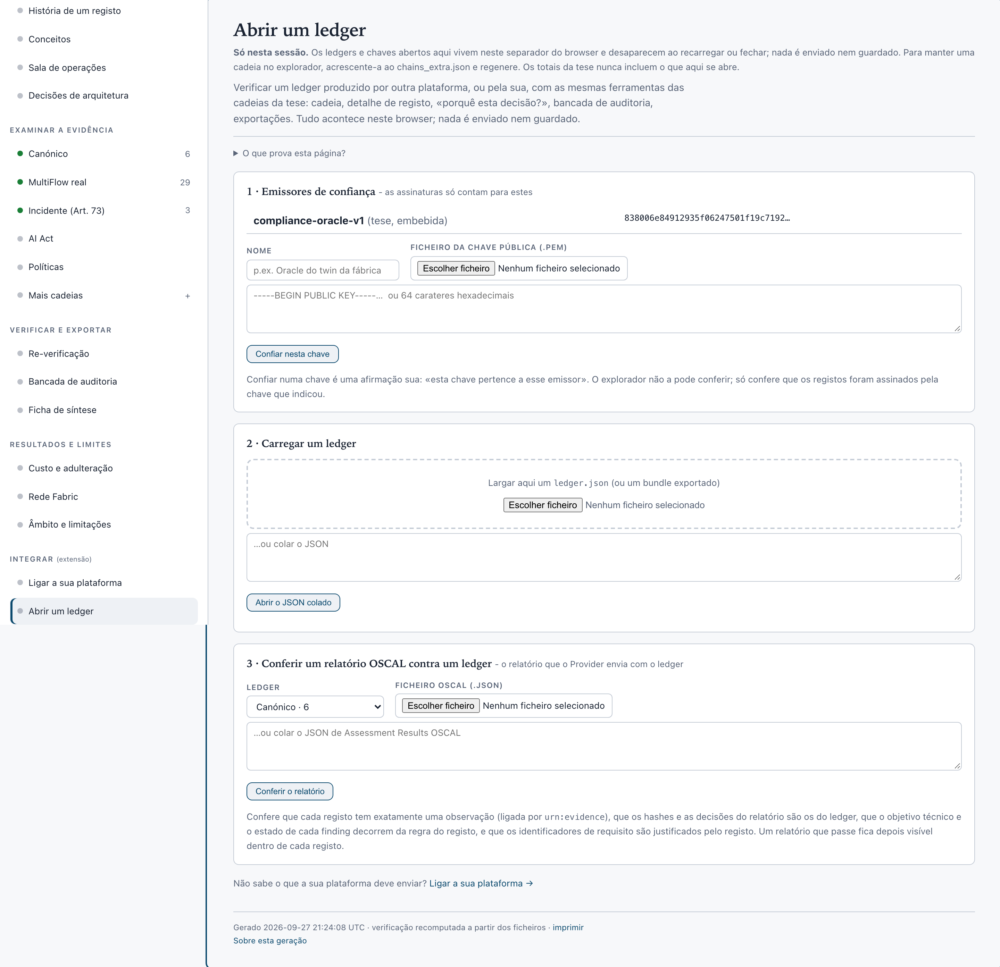

Um ledger é a lista de registos emitidos no formato aceite pelo explorador. A página «Abrir um ledger» lê um ficheiro compatível ou um bundle exportado. Os ficheiros carregados ficam disponíveis apenas no separador atual.

Para repetir um exercício no browser, o pacote inclui um exemplo externo sintético: [ledger com 26 registos](exemplos/twin-factory.json), [chave pública](exemplos/twin-public-key.pem) e [relatório OSCAL](exemplos/twin-oscal.json). Guarde os três ficheiros e siga os passos abaixo. São ficheiros de demonstração do kit de integração; não entram nos totais da dissertação. A chave é uma referência de demonstração, sem certificação independente da identidade do emissor.

### Indicar a chave pública

1. Obtenha a chave pública do emissor e confirme a sua origem por um canal de confiança.
2. Em «Emissores de confiança», escreva um nome que identifique o emissor.
3. Escolha o ficheiro da chave pública em formato PEM, o texto com o cabeçalho `BEGIN PUBLIC KEY`, ou cole a chave no campo. Também é aceite uma chave pública de 64 caracteres hexadecimais.
4. Selecione «Confiar nesta chave» e confirme que aparece na lista.

O nome que escreve é um rótulo escolhido por si. A aplicação verifica a assinatura sob a chave indicada; não certifica a identidade jurídica do emissor. Utilize apenas a chave pública.

### Carregar e consultar

1. Em «Carregar um ledger», clique no seletor de ficheiro e escolha o JSON, ou arraste-o para a zona de carregamento. A escolha inicia a leitura automaticamente.
2. Se preferir colar o conteúdo, use a caixa de texto e clique em «Abrir o JSON colado».
3. Leia a mensagem do carregamento. Quando a cadeia abrir, confira a faixa que a identifica como ficheiro carregado nesta sessão e o resultado dos controlos.
4. Volte a «Abrir um ledger» e desça a «Carregados neste browser». Clique no nome da cadeia para a reabrir.
5. Na cadeia, use os filtros, a fita, o detalhe e as exportações como nas cadeias curtas. A bancada também passa a permitir a sua seleção.
6. Para a retirar da sessão, regresse à lista e clique em «fechar».

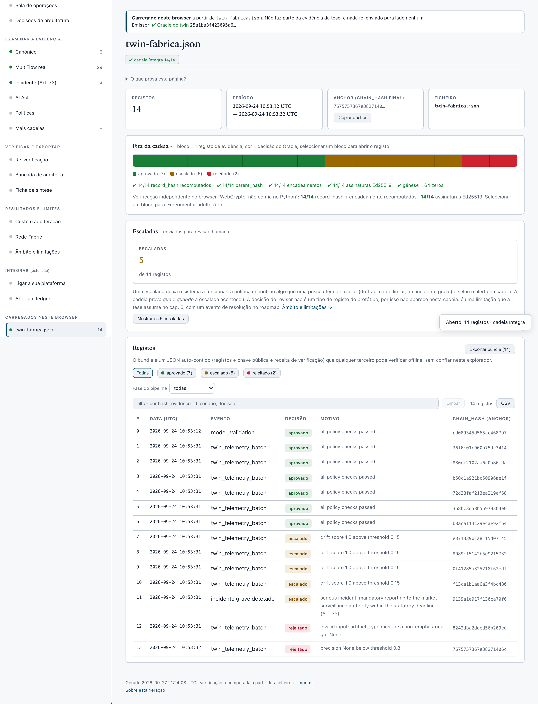

Esta captura portuguesa mostra um exemplo externo anterior, com 14 registos. A versão inglesa mostra `twin-factory.json`, com 26, que é o exemplo distribuído neste pacote. Com a respetiva chave pública e suporte Ed25519, o resultado esperado desse ficheiro é 26/26 assinaturas verificadas. Nenhum dos dois exemplos é uma cadeia da dissertação.

Abrir duas vezes o mesmo conteúdo não cria uma segunda cadeia. Se dois ficheiros declaram a mesma âncora mas têm conteúdos diferentes, a aplicação distingue-os e assinala a situação. Um bundle ou uma lista com um único registo pode ser apresentado como fragmento; a completude continua desconhecida. Se recebeu apenas o objeto JSON de um registo, use «Re-verificação»: «Abrir um ledger» exige uma lista de registos ou um bundle.

Se houver um erro de formato, leia o número do registo e o campo indicado. Corrija a exportação na origem; não elimine campos de um registo assinado para tentar fazê-lo passar.

Para retirar um ficheiro da sessão, volte a «Abrir um ledger» e use «fechar» na lista dos carregados. As chaves externas também podem ser retiradas da lista de emissores. Para voltar a consultar estes dados noutra sessão, reabra o ficheiro e indique de novo a chave pública.

### Conferir o relatório OSCAL

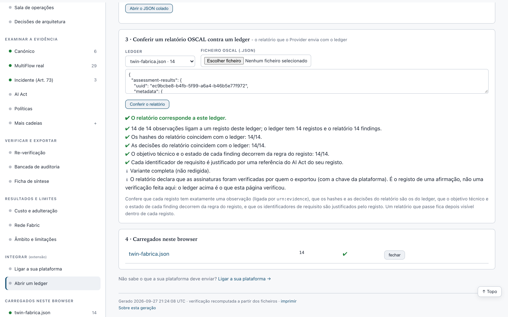

1. Em «Conferir um relatório OSCAL contra um ledger», selecione a cadeia correspondente.
2. Escolha o ficheiro OSCAL JSON. A seleção preenche a caixa e inicia a conferência automaticamente contra a cadeia selecionada.
3. Em alternativa, cole o relatório e clique em «Conferir o relatório». Se mudar a cadeia depois de escolher o ficheiro, volte a clicar nesse botão.
4. Leia os resultados de correspondência entre observações, registos, hashes, decisões e objetivos técnicos, incluindo as mensagens de divergência.
5. Se o relatório for aceite, abra a cadeia, clique num registo e expanda «ver o OSCAL real deste registo». O par associado fica disponível nesse diálogo.
6. Para comparar a apresentação reduzida, faça o exercício da secção 12 e, no fim, reponha a vista de auditor em `off`. O modo simples permanece `off`.

A ligação `urn:evidence` identifica o registo a que uma observação se refere. Um relatório aceite fica disponível no detalhe dos registos. A conferência verifica a coerência da projeção com o ledger; não autentica autonomamente o relatório OSCAL nem realiza uma avaliação jurídica.

«Ligar a sua plataforma» explica o contrato de entrada e apresenta exemplos de eventos. Serve de referência para a equipa que produz os ficheiros. A ligação operacional de uma plataforma ao Oracle exige trabalho na origem; carregar um ledger no browser permite examinar o resultado dessa integração.

### Consultar o contrato e os exemplos de integração

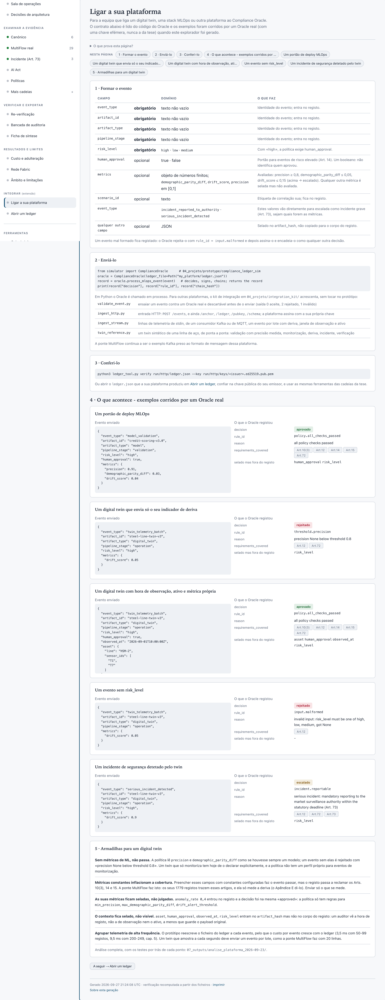

1. Abra «Ligar a sua plataforma» e selecione «1 · Formar o evento» na barra «Nesta página». Leia os campos obrigatórios e os domínios aceites.
2. Vá a «O que acontece - exemplos corridos por um Oracle real» e aos exemplos que se seguem. Compare «Evento enviado» com «O que o Oracle registou», incluindo `rule_id`, motivo e campos selados mas fora do registo.
3. Leia «Armadilhas para um digital twin». Os exemplos são resultados preservados, sem um botão de submissão de eventos.
4. Em «3 · Conferi-lo», clique na ligação «Abrir um ledger» para examinar o ficheiro compatível que recebeu.

A página mostra referências a um kit técnico que fica no repositório do autor. Esse kit não integra o pacote do manual e não é necessário para os exercícios no browser.

## 11. Apresentar e discutir a proposta

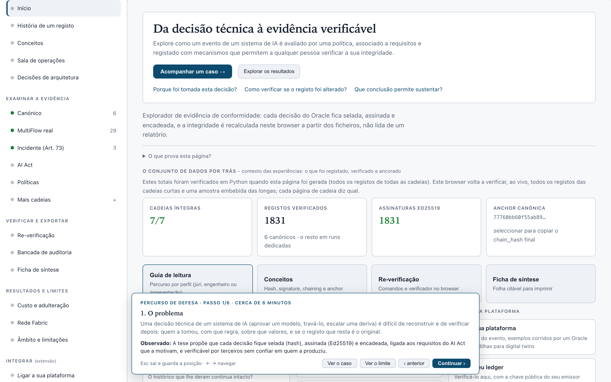

Antes de iniciar, confirme «Modo simples: off» e «Vista de auditor (Art. 78): off». Abra [Percurso de defesa](../Project/ledger_explorer/LEDGER_EXPLORER.html#defesa/1) para começar no primeiro dos seis momentos. O comando de «Ferramentas» pode retomar a posição anteriormente guardada.

1. Leia o título e o observado. Clique em «Ver o limite» para revelar a ressalva desse momento; o mesmo botão recolhe-a.
2. Clique no botão de evidência indicado na tabela seguinte. O rótulo muda conforme o momento.
3. Use «Continuar ›» para avançar e «‹ anterior» para regressar. No último momento, o comando de conclusão termina o percurso.

| Momento | Botão de evidência | Detalhe a abrir |
|---|---|---|
| 1. O problema | «Ver o caso» | História do registo #1. |
| 2. A contribuição num caso | «Ver porquê esta decisão» | Diálogo do #1, com regra, valor e limiar. |
| 3. Integridade | «Ver a adulteração» | Painel da cópia a alterar e re-verificar; no fim, «Repor original». |
| 4. Confidencialidade | «Ver o OSCAL redigido» | Secção OSCAL da cadeia MultiFlow; a vista de auditor é ligada para este momento. |
| 5. Viabilidade e custo | «Ver a integração MultiFlow» | Cadeia da integração e respetivos gráficos. |
| 6. O alcance | «Ver o Anexo IV» | Painel dos 23 pontos, já expandido. |

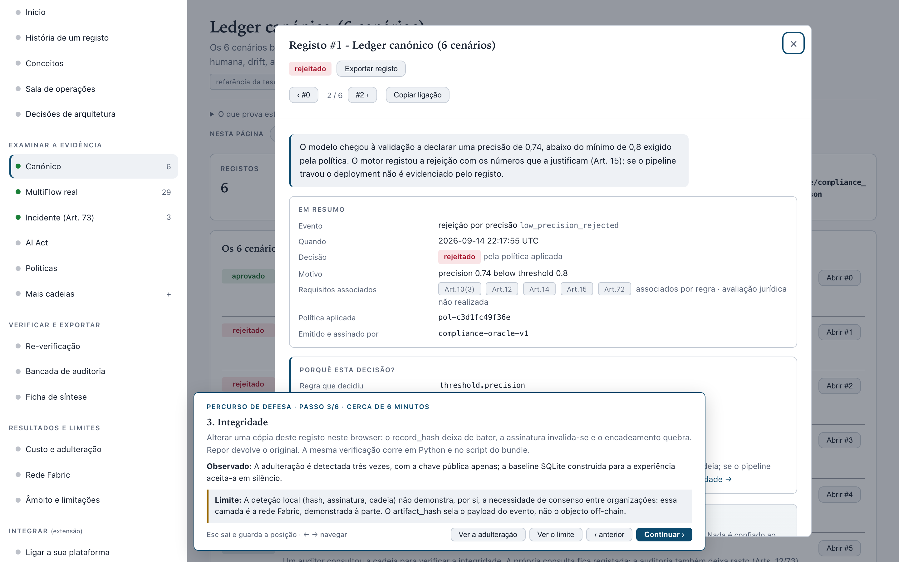

Prima `Esc` para interromper e explorar uma pergunta. Se houver um diálogo aberto, o primeiro `Esc` fecha-o; o segundo sai do percurso. O menu permite retomar no passo guardado; uma ligação como `#defesa/3` abre esse momento.

Para uma visita mais abrangente, escolha [Apresentação](../Project/ledger_explorer/LEDGER_EXPLORER.html#tour/1). Use «seguinte ›» e «‹ anterior», ou `←` e `→`, nos 14 passos. No passo da adulteração, o registo abre automaticamente: altere a cópia, reponha o original e continue pela barra da apresentação. No passo de divulgação seletiva, a vista de auditor liga-se; no seguinte volta a desligar-se. «terminar» encerra a apresentação.

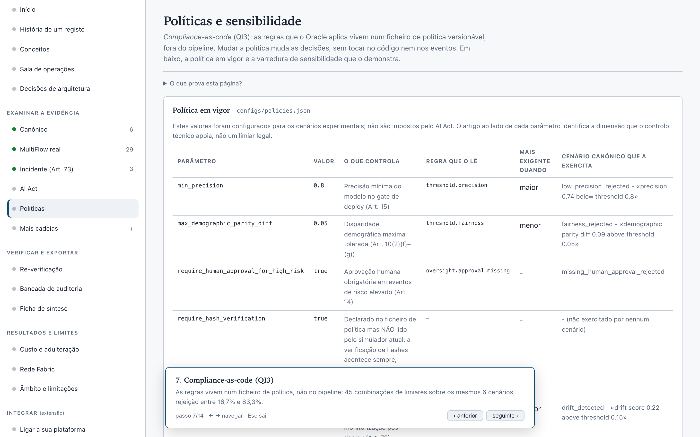

Os percursos mantêm o modo simples em `off`; alteram a vista de auditor nos momentos de divulgação seletiva. Ao terminar ou sair, a aplicação repõe a vista de auditor que estava ativa antes do percurso. Confirme ambas as opções antes de regressar à exploração livre.

Arguentes e orientadores podem abrir diretamente o registo em discussão, ou consultar o artigo e a política que o enquadram. Depois de verificar, conserve a referência da cadeia, a posição, o `evidence_id` e a âncora. Esses elementos permitem voltar ao registo; uma captura de ecrã serve apenas de ilustração.

## 12. Vistas, estados e atalhos

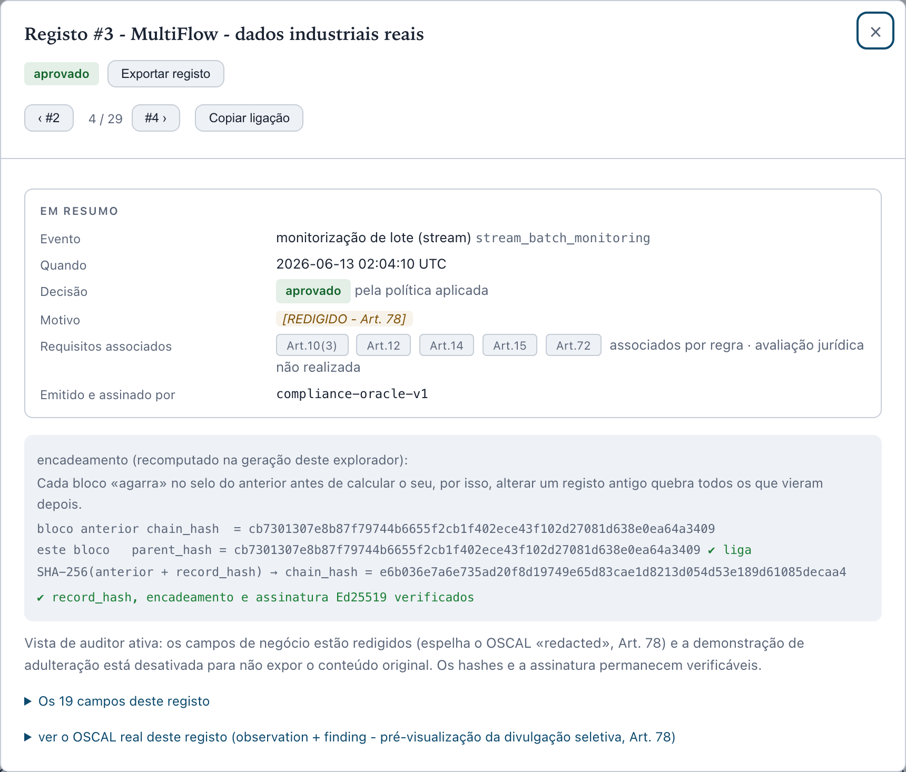

A «Vista de auditor (Art. 78)» oculta no ecrã o motivo, a identidade e o tipo do artefacto e a fase do pipeline. Permite observar a apresentação reduzida. Os campos ocultados permanecem no HTML e os bundles e papéis de trabalho também podem incluí-los; esta opção não controla o acesso ao ficheiro. O CSV respeita os campos ocultados nessa vista.

### Comparar a vista completa com a divulgação seletiva

1. Confirme «Modo simples: off». Abra um registo que tenha OSCAL, leia os campos e o par completo e feche com `×`.
2. Em «Vista», clique em «Vista de auditor (Art. 78)» para passar de `off` a `on`.
3. Reabra o mesmo registo. Confira os marcadores nos campos ocultados e expanda «ver o OSCAL real deste registo»: quando existir a variante redigida, a pré-visualização usa-a.
4. Feche o diálogo. Clique novamente em «Vista de auditor (Art. 78)» para a repor em `off`.
5. Reabra o registo e confirme que os valores completos reapareceram. A demonstração de adulteração também volta a estar disponível nos registos completos.

O modo simples fica desligado durante toda a comparação.

O «Modo simples» fica em `off` em todo este manual. Se a aplicação reabrir com `on`, clique no comando para restaurar a vista completa. A escolha pode ter sido guardada numa visita anterior.

Para mudar o tema, clique no comando do tema em «Vista»; o rótulo passa a oferecer o tema alternativo. Para mudar a língua, clique em «PT · EN» ou «EN · PT». Estas escolhas não alteram os dados. O browser guarda a língua, o modo e o tema quando permite armazenamento local. A versão inglesa usa as mesmas cadeias e ferramentas.

Leia os estados de acordo com o objeto que descrevem:

| Estado | O que significa |
|---|---|
| Aprovado, rejeitado, escalado ou verificado | Decisão declarada pelo motor. «Verificado» é também o nome da decisão do cenário de consulta; não substitui os controlos criptográficos. |
| Hash, ligação ou assinatura confirmados | Resultado do controlo identificado sobre o conteúdo recebido. Cada controlo tem âmbito próprio. |
| Verde ou `✔¹` cinzento | Assinatura válida sob chave reconhecida, ou hashes consistentes sem autenticação por uma chave de confiança, respetivamente. |
| Íntegra | Os controlos do verificador passaram no âmbito indicado. Não prova que todos os eventos da fonte foram capturados. |
| Fragmento | Falta contexto para concluir sobre a cadeia completa. |
| Controlo técnico validado, implementado ou apoiado em parte | Estado registado na Matriz Mestre; não é um juízo global de conformidade legal. |

| Tecla | Ação |
|---|---|
| `/` | Abrir a pesquisa. |
| `?` | Reabrir o guia de leitura. |
| `Esc` | Fechar o diálogo ou sair do percurso. |
| `←` e `→` | Percorrer registos ou passos da apresentação. |
| `Espaço` | Reproduzir ou pausar na sala de operações, quando está no modo de reprodução. |
| `Home` | Voltar ao topo da página. |

Os atalhos de navegação só atuam fora dos campos de escrita. Use também `Tab` e `Shift` + `Tab` para percorrer os controlos; uma linha de registo selecionada abre com `Enter`. Com um diálogo aberto, `Home` não muda a página.

Os dados carregados, as chaves externas e as notas não ficam guardados ao recarregar ou fechar o separador. Descarregue o papel de trabalho antes de terminar. Os registos embebidos na versão recebida permanecem no ficheiro HTML.

## 13. Resolver dificuldades

| Situação | O que fazer no browser |
|---|---|
| Página em branco ou conteúdo incompleto | Confirme que extraiu a pasta comprimida e abriu o HTML num browser. Volte a obter o ficheiro se estiver incompleto. Se a política do browser impedir scripts locais, use a ligação publicada fornecida pelo responsável ou outro browser autorizado. |
| Assinaturas não verificadas | Leia o aviso de suporte e atualize o browser ou experimente outro. Conserve o resultado como parcial até a assinatura ser verificada. |
| «Emissor desconhecido» | Indique a chave pública em «Abrir um ledger», depois de confirmar a sua origem. Não interprete hashes consistentes como autoria confirmada. |
| Um comando não aparece | Desligue o modo simples. Para a demonstração de adulteração, desligue também a vista de auditor e escolha um registo completo da cadeia canónica. |
| O filtro não encontra registos | Selecione «Limpar» e confira a cadeia escolhida. A pesquisa global e o filtro da tabela têm âmbitos diferentes. |
| A âncora é desconhecida | Confirme os 64 caracteres e a versão da cadeia. Uma divergência requer esclarecimento da origem; não substitua a referência recebida pelo valor mostrado só para obter correspondência. |
| A reconferência não encontra a cadeia | Num novo separador, abra os ledgers externos pela ordem da sessão original, indique as chaves e confirme as versões. Fechar e reabrir um ledger na mesma sessão muda o identificador local. |
| O JSON ou o OSCAL é recusado | Leia o campo indicado e confirme que recebeu o tipo de ficheiro exigido. Um CSV não é um ledger nem um relatório OSCAL. |
| Não encontra o download | Consulte a lista de downloads do browser e a pasta configurada. Verifique se o browser pediu autorização para guardar o ficheiro. |
| Perdeu os ficheiros carregados ou as notas | Reabra os ficheiros de origem e use o papel de trabalho descarregado. O explorador não recupera notas que ficaram apenas na sessão. |
| A ligação copiada não abre noutro computador | Se aponta para um ficheiro local, o destinatário precisa da sua cópia do explorador. Use a ligação publicada ou abra a cópia e acrescente o sufixo da página ou registo. |
| As imagens do manual não aparecem | Mantenha a pasta `capturas` junto de `MANUAL_UTILIZACAO.html` e extraia todos os ficheiros do pacote. |

Para identificar a versão numa discussão, consulte «Sobre esta geração» no rodapé. Registe a data de geração, a cadeia e a mensagem observada. Esses elementos permitem distinguir um problema de utilização de uma diferença entre ficheiros distribuídos.
