# Compliance Ledger Explorer: user manual

## 1. Open the platform with Simple mode off

The Compliance Ledger Explorer brings together the technical decisions recorded in the dissertation prototype. Use it to inspect the policy applied to an event, verify record integrity and try the demonstration exercises. The Compliance Oracle evaluates incoming events and issues the decisions displayed here.

You can use it without installing software, creating an account or knowing how to program.

This manual uses the full view: «Simple mode: off». Every path starts in that state. «Auditor view (Art. 78)» also stays off, except in the selective-disclosure exercise in section 12 and the guided steps that enable it.

1. If you received a compressed folder, extract its contents before opening the files.
2. Open `LEDGER_EXPLORER.html` in an updated browser, such as Chrome, Edge, Firefox or Safari. If you received a published link, open that link.
3. Wait for the page to load. The first visit opens in English. If the welcome guide appears, choose «Explore without a guide» to reach the menu.
4. In «View», check the language. «EN · PT» switches to Portuguese; «PT · EN» switches back to English. Use English for the paths in this manual. «Reading guide» reopens the welcome panel.
5. Scroll the sidebar to «View». The state next to «Simple mode» must read `off`. If it reads `ON`, click «Simple mode» once and confirm `off`.
6. Check that «Auditor view (Art. 78)» also reads `off`. If it reads `ON`, click once to turn it off. Reasons and identification fields should be visible in the records.
7. Check that the menu includes «Operations room», «Architecture decisions», «More chains», «Fabric network», «Connect your platform» and «Open a ledger». Scroll down if the last entries are outside the visible area.

Click a screenshot in this manual to open the original image in another tab, then use browser zoom to read the details. Screenshot controls work in the platform, not in the image.

To keep the manual visible while exploring, use the right-click menu to open a platform link from a later section in another tab. The instructions use the English interface labels. Some source texts, including ADR descriptions and provenance narratives, remain verbatim in Portuguese.

Cryptographic verification depends on browser capabilities. Read the support warning in the application. If signatures remain unverified, update the browser or try another; hash confirmation alone is a partial result.

Files you load are read and verified in this browser. The application does not send them to an external service. A published version requires downloading the page from its address; once you have the local HTML, you can consult it without an Internet connection.

This version contains seven chains and 1,831 records. Short chains are fully re-verified in the browser. For Steel, which has 1,750 records, browser verification covers 62 complete embedded records; the remaining content is displayed in compact form. The full result shown on that page was computed when the explorer was generated.

## 2. Choose a path and use the menu

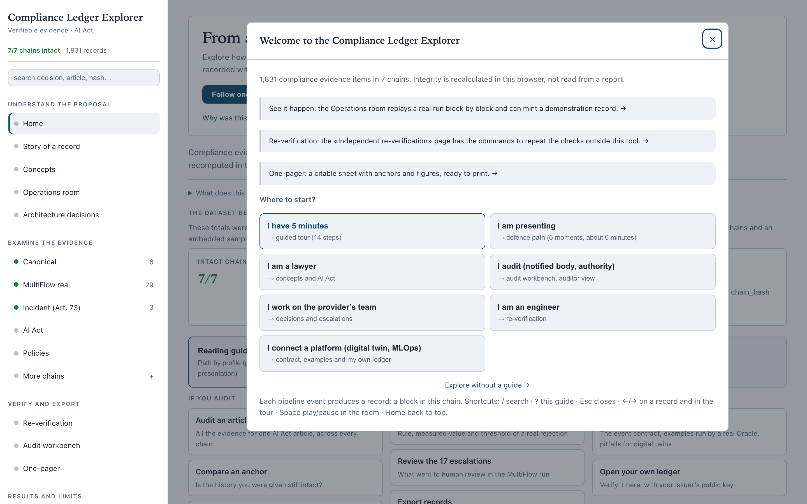

Reopen «Reading guide» from the menu or with `?`. Its cards suggest a starting page; you can change paths at any time.

| Reader | Suggested path | Task |
|---|---|---|
| Community and first visit | «I have 5 minutes», or «Story of a record» → «Concepts» → «Canonical» | Understand the proposal and open a concrete example. |
| Examiners | «Defence path» → «AI Act» → «Audit workbench» → «Scope & limitations» | Compare a claim with its supporting record and its limit. |
| Supervisors | «Story of a record» → «Policies» → «Cost & tampering» → «Scope & limitations» | Review the relationship between the decision, the experiment and the interpretation. |
| Auditors and researchers | «Re-verification» → «Audit workbench» → «One-pager» | Verify records, preserve results and repeat a sample. |
| Technical teams | «Connect your platform» → «Open a ledger» | Consult the contract and verify compatible files. |

To follow this manual, enter through «Explore without a guide» and choose pages from the full menu. «I am a lawyer» turns Simple mode on: restore «Simple mode: off» in «View» if you select that card. «I audit» enables Auditor view; restore it to `off` to examine full details. The suggested paths do not require selecting those cards.

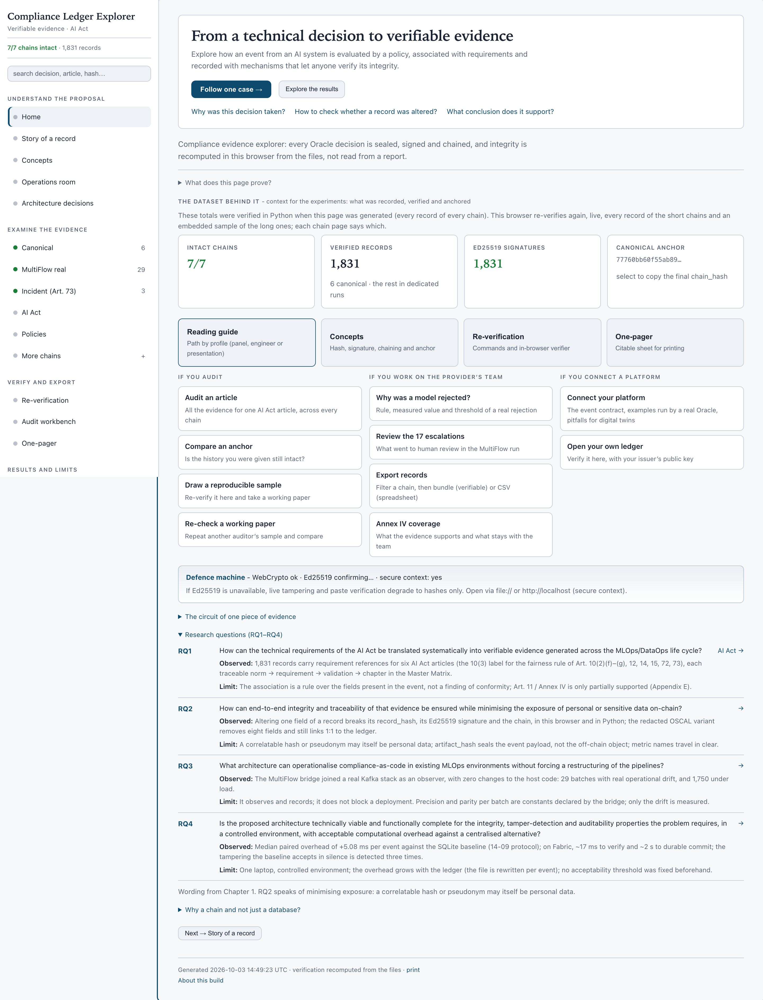

### A first verification

This exercise uses only the data included in the platform:

1. Open [Canonical](../Project/ledger_explorer/LEDGER_EXPLORER.html#canonico) and choose «Records» in «On this page».
2. Select «rejected». Three records should appear. Open #1: its reason reports precision 0.74, below the 0.80 threshold.
3. Close the detail and open [Re-verification](../Project/ledger_explorer/LEDGER_EXPLORER.html#verify). Select «Load example (canonical #1)»; verification starts automatically.
4. Check `record_hash`, `chain_hash` and signature results. The predecessor link cannot be confirmed because only one record was supplied. Without Ed25519 support, the signature remains unverified.
5. Open [Audit workbench](../Project/ledger_explorer/LEDGER_EXPLORER.html#audit), choose «Canonical», leave the article as «any», set size `6` and seed `first-visit`. Select «Draw and verify». With Ed25519 support, expect 6/6 verified records.
6. Download the working paper and select that file in «Re-check a working paper». The chain, anchor, positions and records should match.

If a result differs, read the failed check and consult «Troubleshooting».

### Available pages

The menu groups pages by task:

| Group | Pages and purpose |
|---|---|
| Understand the proposal | [Home](../Project/ledger_explorer/LEDGER_EXPLORER.html#overview), [Story of a record](../Project/ledger_explorer/LEDGER_EXPLORER.html#historia), [Concepts](../Project/ledger_explorer/LEDGER_EXPLORER.html#conceitos), [Operations room](../Project/ledger_explorer/LEDGER_EXPLORER.html#ops) and [Architecture decisions](../Project/ledger_explorer/LEDGER_EXPLORER.html#adrs). |
| Examine the evidence | [Canonical](../Project/ledger_explorer/LEDGER_EXPLORER.html#canonico), [MultiFlow real](../Project/ledger_explorer/LEDGER_EXPLORER.html#multiflow_real), [Incident](../Project/ledger_explorer/LEDGER_EXPLORER.html#incidente), [AI Act](../Project/ledger_explorer/LEDGER_EXPLORER.html#aiact), [Policies](../Project/ledger_explorer/LEDGER_EXPLORER.html#policies) and «More chains». |
| Verify and export | [Re-verification](../Project/ledger_explorer/LEDGER_EXPLORER.html#verify), [Audit workbench](../Project/ledger_explorer/LEDGER_EXPLORER.html#audit) and [One-pager](../Project/ledger_explorer/LEDGER_EXPLORER.html#ficha). |
| Results and limits | [Cost & tampering](../Project/ledger_explorer/LEDGER_EXPLORER.html#perf), [Fabric network](../Project/ledger_explorer/LEDGER_EXPLORER.html#fabric) and [Scope & limitations](../Project/ledger_explorer/LEDGER_EXPLORER.html#limits). |
| Integrate (extension) | [Connect your platform](../Project/ledger_explorer/LEDGER_EXPLORER.html#connect) and [Open a ledger](../Project/ledger_explorer/LEDGER_EXPLORER.html#open). These tools extend beyond the dissertation's original evaluation. |

After loading files or writing notes, change pages with the platform menu. Opening the explorer again from a manual link may start another session.

Guided paths are under «Tools». Use «View» for language, Simple mode, theme and Auditor view. If the window is narrow, «Menu» opens the sidebar.

### Controls shared by several pages

| Where to click | What appears and how to return |
|---|---|
| «What does this page prove?», below the title | Expands the explanation of the page's scope. Click the title again to collapse it. |
| An «On this page» button | Scrolls to that section within the page. «↑ Top» returns to the top. |
| A title with a small triangle | Expands collapsed content. Click again to close it. |
| «Next → …» at the bottom | Opens the next suggested page. You can also use the sidebar. |
| «About this build» in the footer | Reveals the version, build references and cryptographic support. Click again to collapse. |
| «print» in the footer | Opens browser printing; choose save as PDF to preserve the page. |
| `×` at the top right of a record | Closes the dialogue. `Esc` or clicking outside also closes it. |

Requirement, chapter and file labels are not always links. Use the buttons and responsive text; some identifiers are references for reading only.

Search from the menu field or press `/`. Global search looks across available chains for hashes, `evidence_id`, scenarios, decisions, reasons and articles. Each result names its chain. Click a result to open the record.

### Global search, including annex chains

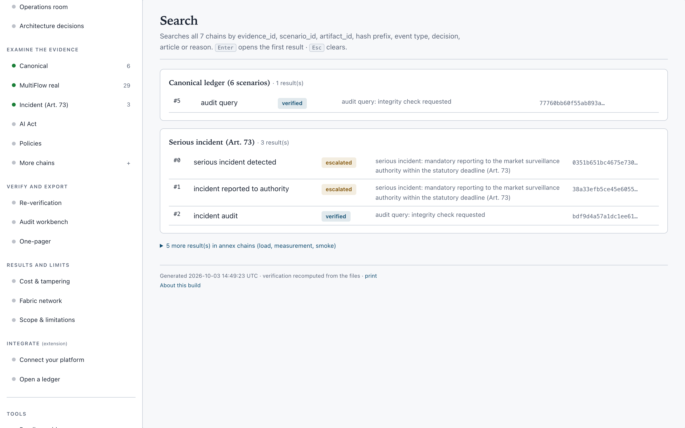

1. Click the sidebar search box and enter at least two characters. Try `Art. 73`, `drift_detected` or a hash prefix.
2. Read the results grouped by source chain. `Art. 73` and `Art.73` are treated alike.
3. Click a row to open its record. `Enter` in the search box opens the first result.
4. Expand «… more result(s) in annex chains (load, measurement, smoke)» when it appears. The additional chains' results then become visible.
5. Close the record with `×`. Clear the search text to start another search; `Esc` also clears a focused search box.

### Clicks on Home

1. Click «Follow one case» to open the story of canonical record #1. «Explore the results» opens the canonical chain.
2. Click «Why was this decision taken?» to open that record. The alteration question opens its demonstration; the conclusion question opens «Scope & limitations».
3. Click the anchor card to copy the full hash, even when the card displays an abbreviation.
4. Expand «The circuit of one piece of evidence». Click its blocks: event and record lead to Canonical, Oracle to Operations room, OSCAL to AI Act, and audit to Re-verification.
5. Expand «Research questions (RQ1–RQ4)» if collapsed. Read each question's observed result and limit before following its evidence link.
6. Expand «Why a chain and not just a database?». The tampering button opens the record; the numbers button opens «Cost & tampering».
7. In the task cards, choose anchor comparison, working-paper re-check, Annex IV or escalations. Each opens the relevant page and panel.

## 3. Understand a record

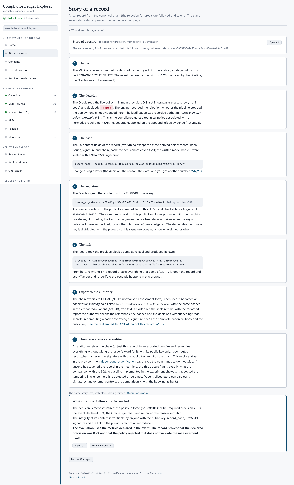

Open «Story of a record». It follows canonical record #1 through seven steps. `#1` is its position in the chain; numbering begins at `#0`.

The event declared precision 0.74. The policy required at least 0.80, so the Oracle recorded a rejection. Later steps show the identified policy, preserved values and verification mechanisms.

The record preserves what the Oracle received and declared. Cryptographic verification does not validate the measurement or automatically re-execute the whole policy. Some event data, such as human approval, are absent from the record body; a complete reconstruction may require the original event and archived policy.

«Concepts» explains four terms used elsewhere:

| Term | Meaning in the explorer |
|---|---|
| Hash | A value computed from content. It lets you check whether received content reproduces the preserved value. |
| Ed25519 signature | A check that content matches a signature under a particular public key. Assigning that key to an issuer requires a trusted reference. |
| Chaining | Hash links between successive records. They order the records received in a chain. |
| Anchor | A final hash preserved as a reference for comparing a chain or its prefix. |

Legal analogies in «Concepts» explain the mechanism. They do not give prototype signatures the effects of a notarial act or a qualified service.

«Architecture decisions» presents six documented architecture decision records (ADRs), their alternatives and the reasons for each choice.

### Open details in the story, concepts and ADRs

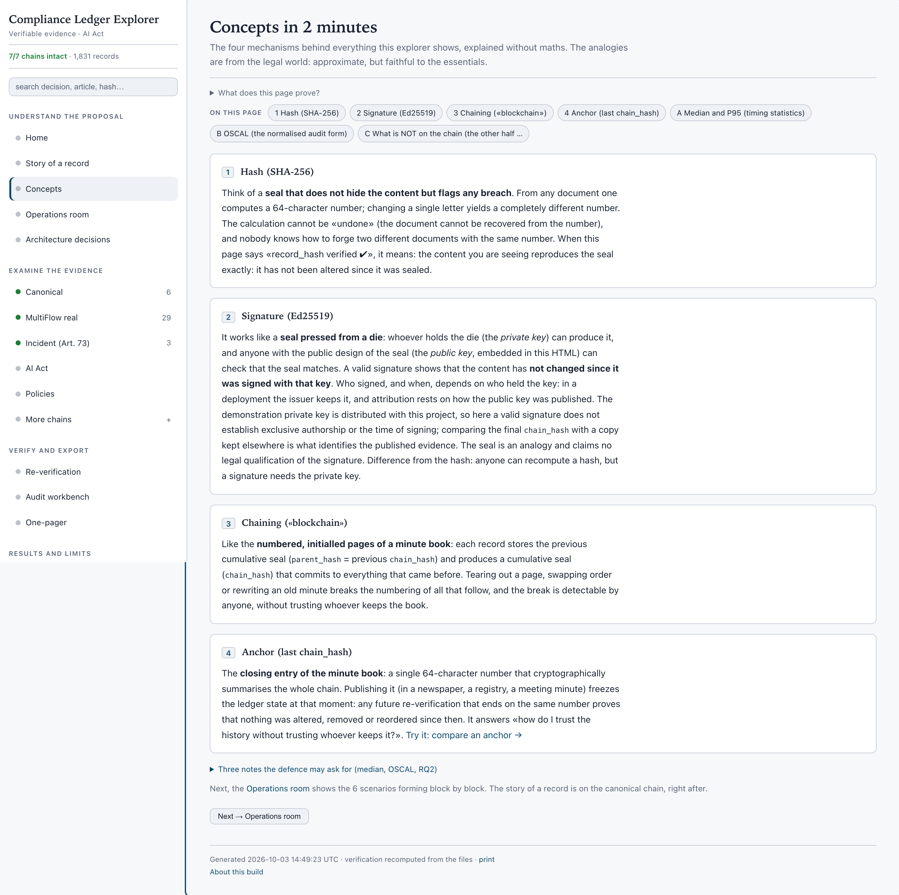

1. Read the seven steps in «Story of a record». Click «Open #1» to compare the narrative with the record body.
2. In the OSCAL step, follow the link to the embedded real pair. Its text identifies the chain and position; in the dialogue, scroll down and expand «see the real OSCAL of this record».
3. In «Concepts», expand «Three notes the defence may ask for (median, OSCAL, RQ2)» to reveal the explanations of the median, report and second research question.
4. In the anchor explanation, click «Try it: compare an anchor →». Re-verification lets you repeat the comparison in section 7.

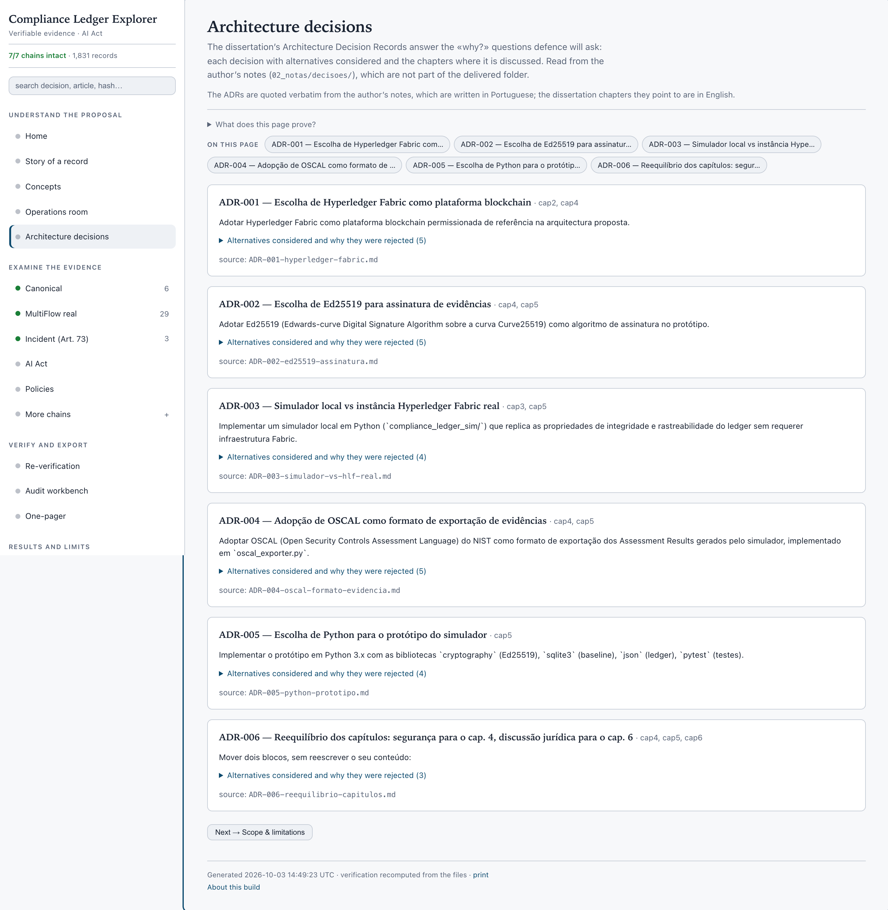

5. Open «Architecture decisions» and choose an ADR in «On this page», such as ADR-001.
6. Click «Alternatives considered and why they were rejected». A table opens with the alternatives and reasons. The number in parentheses counts that ADR's alternatives.
7. Expand the other five ADRs too. Read the decision and chapter references above each table; the top ADR buttons only scroll within the page.
8. Collapse the table by its title or follow «Next → Scope & limitations».

## 4. Inspect chains and records

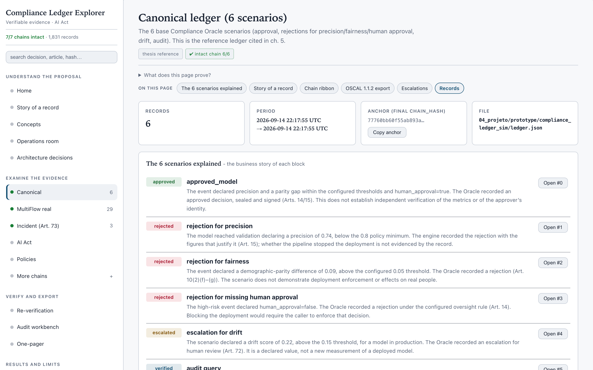

Click «Copy anchor» in the header to preserve the final `chain_hash`. Cards show the source file and build-time result. A file path is a reference, not an automatic file load. «Open #…» opens a canonical scenario directly.

### Find and filter records

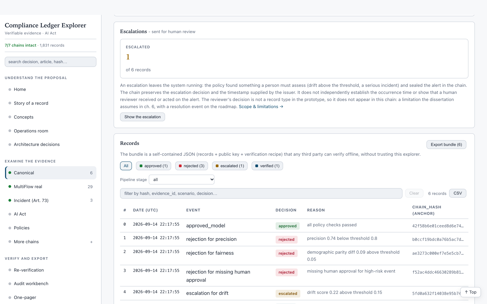

1. Open «Canonical» from the menu. Its header identifies the chain, record count and final anchor.
2. Choose «Records» in «On this page» to reach the table.
3. Choose a decision such as «rejected». Canonical shows three records under this filter.
4. Combine it with the pipeline-stage filter or text field. A pipeline is the sequence of processing stages. Date filters also appear when the data cover several days.
5. Select «Clear» to restore the full set. Larger tables have pagination controls.
6. Click a row to open its detail. On a short chain, you can also click a ribbon block.

Expand «More chains» for [Steel](../Project/ledger_explorer/LEDGER_EXPLORER.html#multiflow_steel), [Fabric latency records](../Project/ledger_explorer/LEDGER_EXPLORER.html#fabric_gateway), [Fabric chaining demo](../Project/ledger_explorer/LEDGER_EXPLORER.html#fabric_demo) and [the first MultiFlow run](../Project/ledger_explorer/LEDGER_EXPLORER.html#multiflow_smoke). Their descriptions distinguish load tests, measurements and earlier runs.

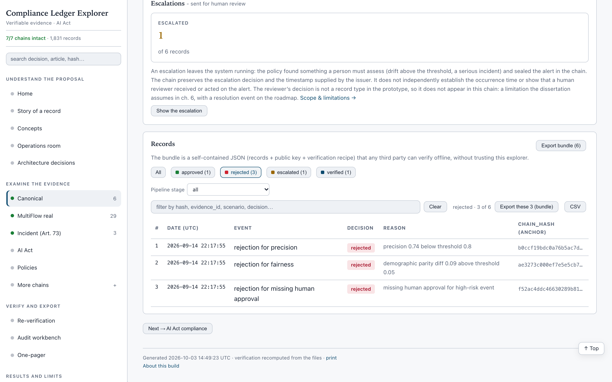

The selected decision is highlighted. Click it again to remove it, or choose «All». «Clear» also removes text, stage and dates. The counter shows how many records match. Pagination changes the visible rows; CSV and filtered bundles include every matching row.

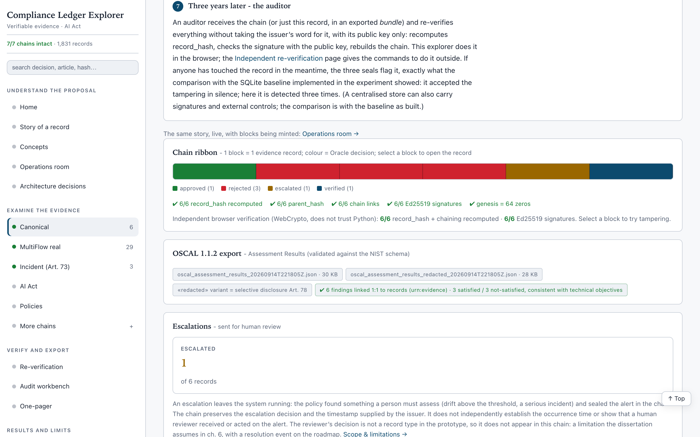

In a short-chain ribbon, hover over a block to read its position, event and decision. Click to open it. Steel's ribbon groups consecutive decisions and does not open individual records: use the table. Below the ribbon, a band separates build-time verification from this browser's independent check; once it finishes, read how many signatures were actually verified.

If a problem list appears, click «record #…» to open the affected position. In the escalation panel, «Show the escalation» or «Show the … escalations» filters the table. Open a row, then use «Clear» afterwards.

### Read the detail

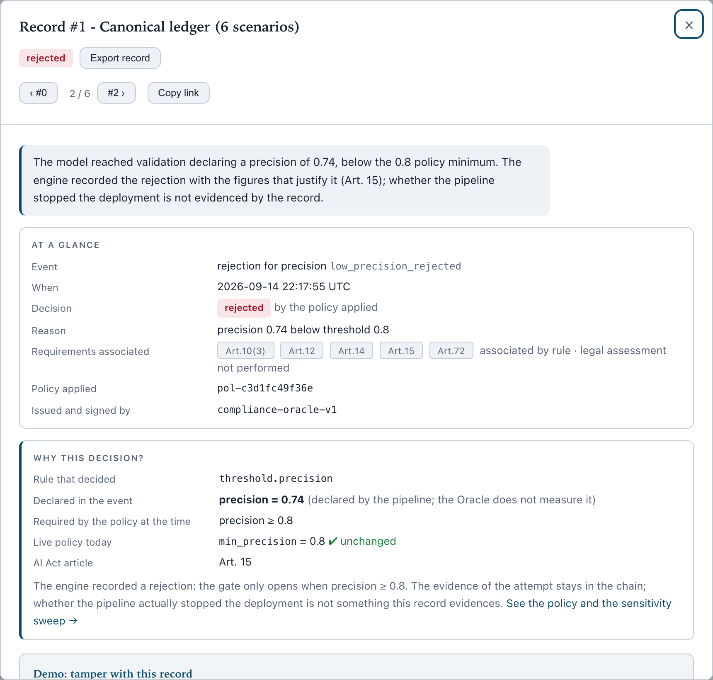

The dialogue starts with «At a glance»: event, date, decision, reason, associated requirements, policy and issuer. «Why this decision?» shows the preserved rule and values. Compare the policy applied at recording time with today's embedded policy when both appear.

To expand the dialogue's details:

1. Open canonical #1 and read «At a glance». Scroll inside the dialogue to «Why this decision?». Compare the rule, declared value, applied threshold and current embedded policy. This panel appears where the explorer can explain the recorded reason.
2. Scroll to «All 23 fields of this record» and click its triangle or title. The complete body becomes visible. Locate `rule_id`, `metrics`, `policy_id`, `policy_hash` and the cryptographic fields.
3. Inside that panel, click «What does each field mean?» for a second list defining the fields present. Hover over a field name for brief help.
4. Click a long hash or identifier labelled «select to copy» to copy its full value. Reasons, metrics and article labels do not use this control.
5. Collapse the fields and expand «see the real OSCAL of this record (observation + finding)» when available. Read both structures and their record link. `satisfied` or `not-satisfied` describes the specified technical objective.
6. Click the titles again to collapse them. Use `‹ #0` or `#2 ›` at the top to compare neighbouring records.
7. Click «Export record» to preserve the example, or «Copy link» to preserve its destination. Close with `×`.

The field count varies by record; earlier runs can have fewer than 23. Long-chain compact-view messages explain why the full body and individual export are absent.

OSCAL is the structured format used to organise observations and assessment results. The Oracle associates articles in `requirements_covered` from event fields. Their presence does not mean that every rule in those articles was executed or that a legal assessment found conformity.

Use `←` and `→` to move between records. «Copy link» preserves a destination such as `#canonico/1`. A local-file link requires the recipient to have a copy of the explorer; open that copy and use the same suffix. A published link works at the shared address.

### Demonstrate an alteration

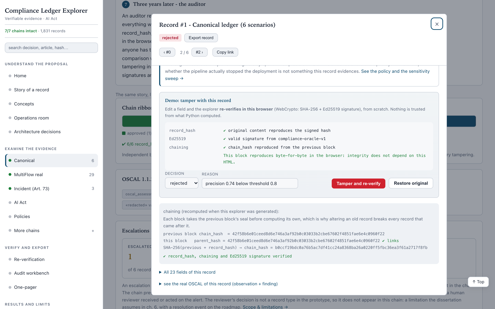

1. Open a complete canonical record with Auditor view off.
2. Scroll to «Demo: tamper with this record». Before editing, read the original `record_hash`, Ed25519 and chaining results.
3. Change «Decision», or enter a different «Reason». For example, change «rejected» to «approved» and retain the other values.
4. Click «Tamper and re-verify». Read the original/altered comparison, recomputed hash, signature, `chain_hash` and next-block link when present.
5. Click «Restore original». Fields and checks return to the preserved record. Close with `×`.

The exercise changes an in-memory copy. Original records remain preserved. Changing the body in this exercise breaks recomputation and signature checks; other changes may affect different checks. Read each result separately.

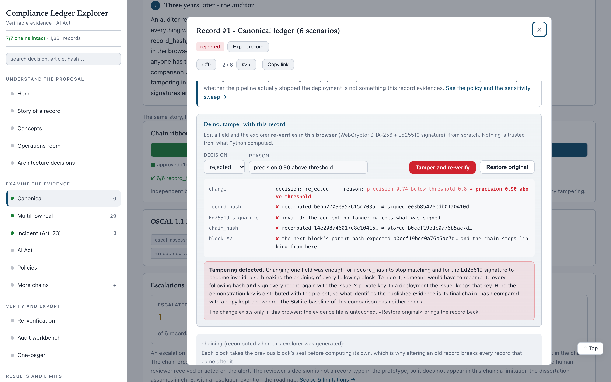

The image shows a changed reason and the corresponding failures. The lower chaining panel still describes the original verified at build time; the experiment's result is in the tampering panel.

## 5. Explore demonstrations and policies

### Operations room

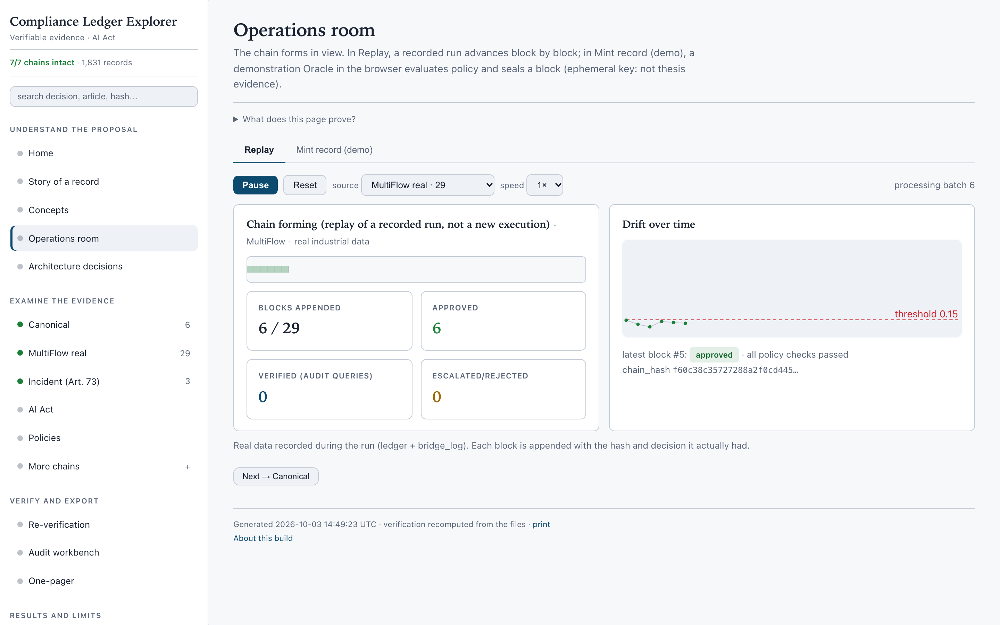

1. Open «Operations room» and select «Replay».
2. Open «source» and choose Canonical or MultiFlow real. Changing source restarts that run's presentation.
3. Choose speed `1×`, `2×`, `4×` or `8×`. Click «Play» and watch the ribbon and counters.
4. «Pause» stops at a point; «Resume» continues.
5. Click a visible ribbon block to open the original source-chain record. Read its details and close with `×`.
6. Inspect the latest decision and drift chart where that source has a series. If «Play MultiFlow real» appears, click it to switch source.
7. Click «Reset» to return to the start. You can repeat at a slower speed.

Replay does not collect new data or connect this browser to an industrial installation.

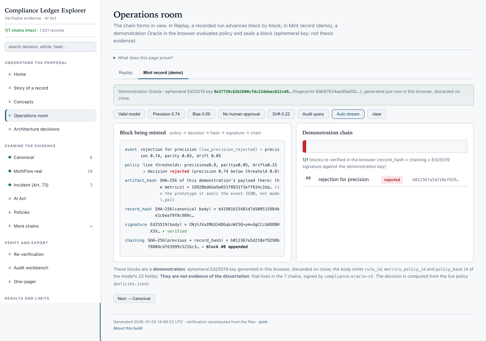

Choose «Mint record (demo)» and one of the available events. The demonstration Oracle computes the decision and displays the record-building stages. Repeat with another event. «Auto stream» starts sequential minting and changes to «Stop stream»; click it to stop. «clear» removes this session's demo records.

These records use an ephemeral browser-generated key and disappear when the session ends. Their format omits four fields of the complete model: `rule_id`, `metrics`, `policy_id` and `policy_hash`. They demonstrate the mechanism and do not enter dissertation results.

Click a newly minted row to open «Demonstration block #…» with the fields actually present. Scroll down and expand «What does each field mean?»; its help list includes model fields this demo may omit. Close with `×` before minting again. «clear» resets the ephemeral key too, starting a separate demonstration sequence.

### MultiFlow

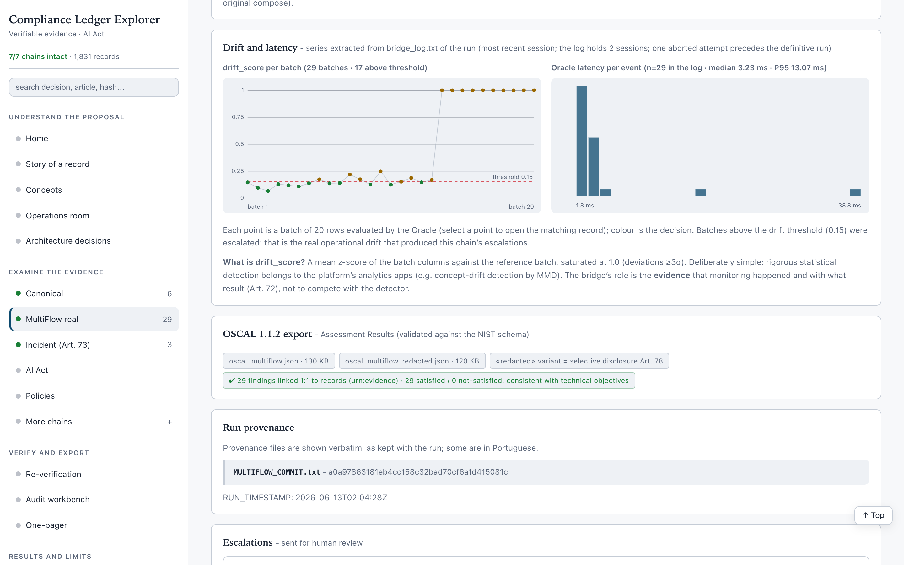

1. Open «MultiFlow real» and use «On this page» to reach drift and latency charts.
2. Hover over a drift point for its batch, value, decision and record position.
3. Click that point to open the record. Expand its fields to compare the metric with the reason. Close with `×`.
4. Hover over a latency histogram bar for the millisecond interval and event count. This chart does not open records by clicking.
5. Click «Show the … escalations», open a row and read its reason. «Clear» returns to all 29 records.
6. Consult the bridge panel for the source and integration scope. Its explanatory boxes are not operating controls.

The MultiFlow bridge computed `drift_score`, an indicator of data differences against a reference batch. Configuration supplied precision and the demographic-parity gap between groups. Industrial data were replayed in the experiment; the bridge observes and records decisions, without demonstrating deployment blocking or a supervisor's subsequent intervention.

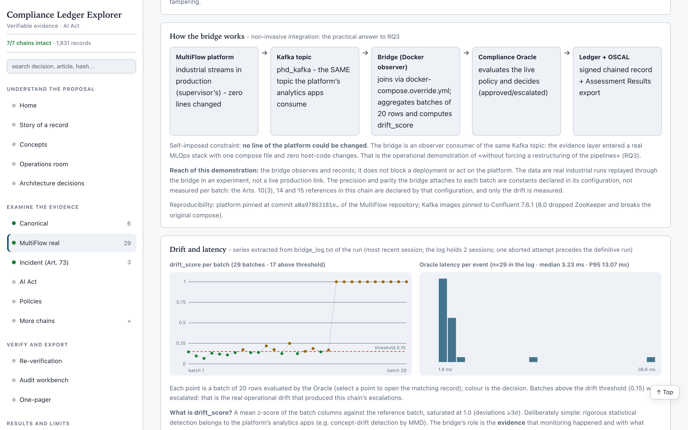

### Policies and sensitivity

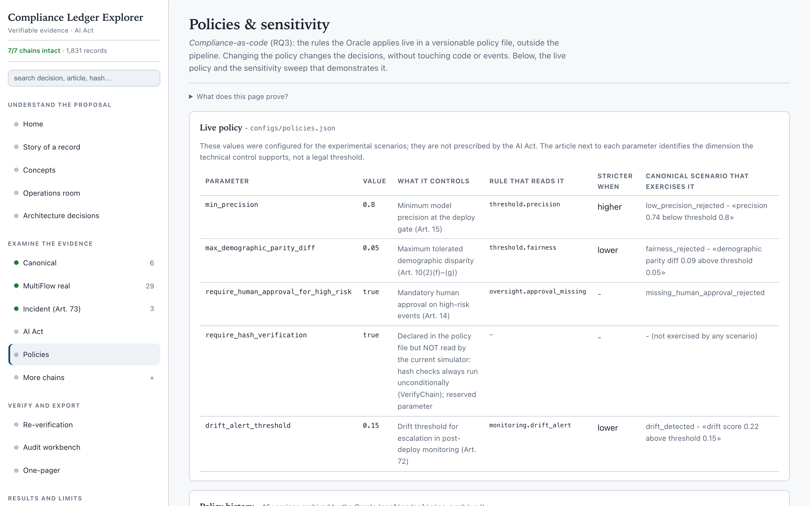

In «Policies», read each parameter, the rule using it and its scenario. Thresholds were chosen for the experiments. The table does not present them as values imposed by the AI Act.

### Open a threshold combination

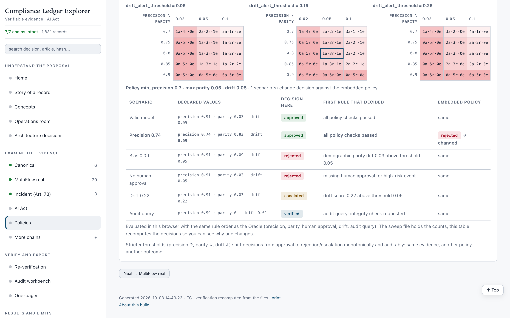

1. In «Policies», scroll to «Sensitivity analysis». There are three grids, one per drift threshold.
2. Hover over a cell for the three thresholds and counts. The row is minimum precision; the column is maximum parity gap.
3. In `drift_alert_threshold = 0.05`, click row `0.7`, column `0.05`. You can also select the cell with `Tab` and open it with `Enter`.
4. Read the table below: six scenarios, declared values, decisions with that combination, first rule and comparison with the embedded policy. Here, precision 0.74 is no longer rejected by a 0.80 threshold.
5. Click the highlighted embedded-policy cell: precision `0.8`, parity `0.05`, drift `0.15`, to read the reference.
6. Choose another combination and inspect the changed rows. It replaces the previous detail; the result rows are read-only.

Grid counts come from the preserved experiment. The six-scenario detail is recomputed in this browser. Colour summarises rejection rate; the displayed rule explains a decision.

The engine stops at the first applicable rule. An earlier check can decide before a drift alert. Selecting a cell evaluates that combination in the demonstration; it does not change the prototype policy.

### Expand policy history

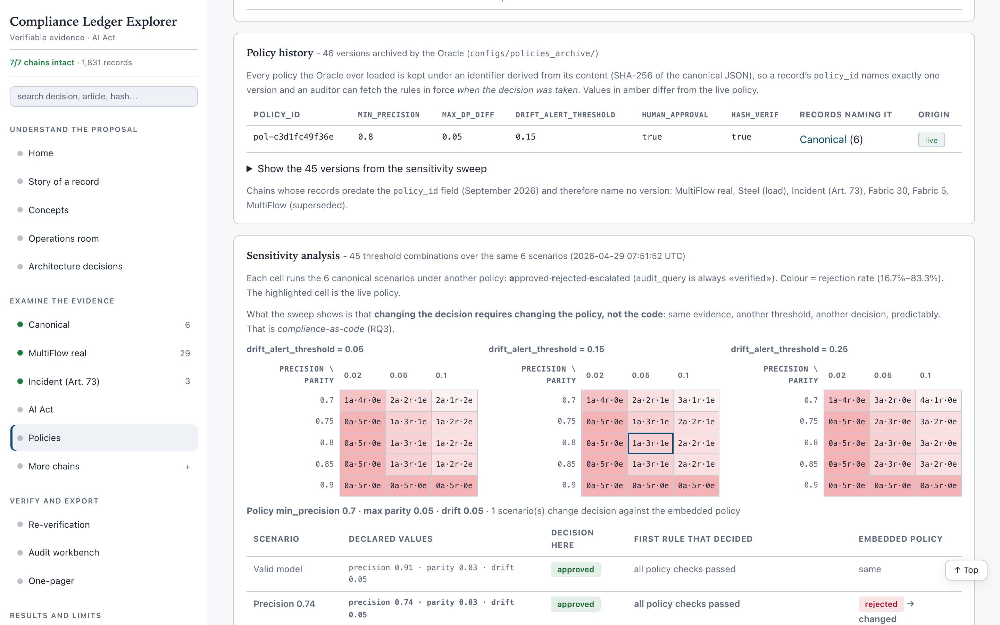

1. Scroll to «Policy history». Its initial row identifies the current policy and the records naming it.
2. Hover over `policy_id` for the full `policy_hash`. This field does not open a policy editor.
3. Click «Canonical (6)» in the records column to open the associated chain. Open a record and compare its `policy_id` with the history row.
4. Return to «Policies» and expand «Show the 45 versions from the sensitivity sweep» for version thresholds and origins.
5. Compare amber values with the current policy. Read the warnings for chains predating `policy_id`; their records do not identify a version through that field.
6. Click the title again to collapse the 45 versions. This build has 46 archived policy versions.

## 6. Examine the framework and results

### Open evidence for an article

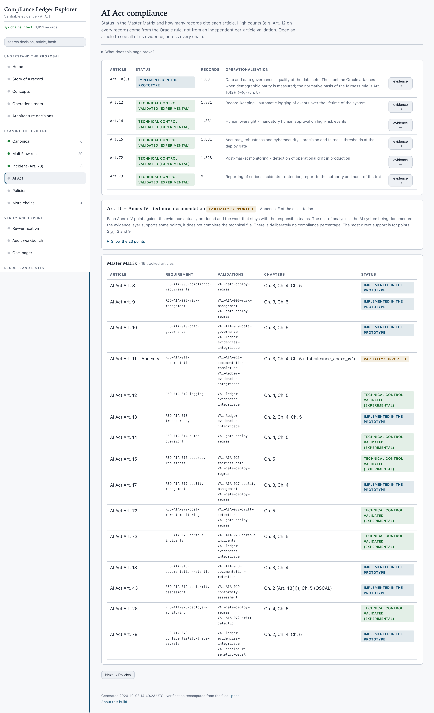

1. Open «AI Act». Find Article 15 in the first table and click «evidence →».
2. Read its status and explanation. In the end-to-end case, click the rule or value/threshold box to open «Policies». Return through AI Act and the article's evidence button.
3. Click the decision/position box, such as «rejected #1», to open the record. The «verify» box opens the same record at its tampering exercise.
4. Click the validation box for «Cost & tampering». Article and requirement boxes present references; they do not open a legal assessment.
5. In «Traceability», read requirements, validations, chapters and status. These identifiers preserve documentary links; they do not load chapters in the browser.
6. Scroll to each chain's evidence table. Click a row for its record. «Export … as bundle» downloads that chain's article-associated records when full export is available.
7. Expand «… more in annex chains (load, measurement, smoke)» to reveal the collapsed tables.
8. Click «Open the chain filtered by this article →». The chain opens with the article filter; «Clear» restores all records.
9. Return to «AI Act» to choose another article; «← All articles» also returns from an article page.

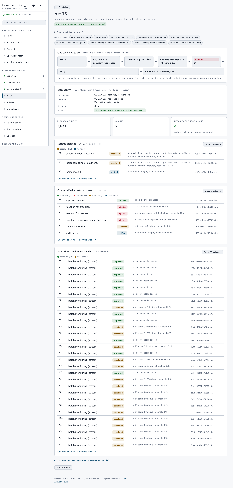

The path links article, requirement, technical rule, record and validation. Consult the indicated dissertation chapters to compare the interpretation with the written argument.

Master Matrix status describes technical support: experimentally validated, implemented or partly supported. It is not a declaration of conformity. The Article 11/Annex IV panel distinguishes available evidence from documentation still needed.

### Expand the 23 Annex IV points

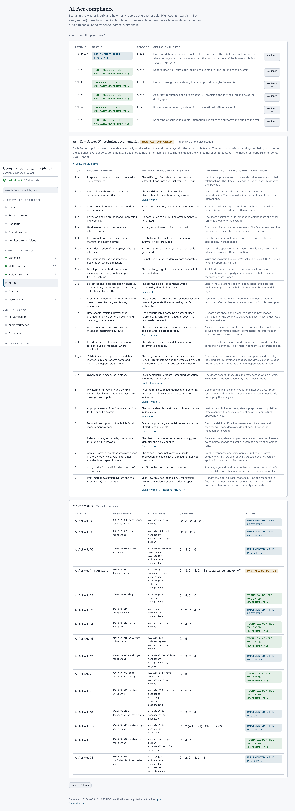

1. On the main «AI Act» page, find «Art. 11 + Annex IV - technical documentation».
2. Click «Show the 23 points». The table sets out required content, evidence and limits, and remaining human or organisational work.
3. Follow available evidence links such as «Canonical», «Canonical #3», «MultiFlow real», «Policies», «Cost & tampering» or «Incident (Art. 73)». Each opens the indicated page or record.
4. Return to «AI Act» and expand the points again if changing pages collapsed the panel.
5. Scroll to «Master Matrix» to compare each article's requirements, validation and chapters. The Master Matrix is a reference table; record counts appear in the article table.
6. Click «Show the 23 points» again to collapse the panel.

References to other laws in loaded ledgers appear under «Other laws referenced in the evidence». Click «evidence →» there to see the law and its referencing records, with an indication that they fall outside the dissertation's Master Matrix.

Other pages examine particular experiments:

| Page | Use and interpretation |
|---|---|
| Incident (Art. 73) | Follow detection → simulated report → query and read record intervals. It does not send a real authority report. |
| Cost & tampering | Consult the protocol, two local runs and result spread. Timings compare complete execution paths; they do not isolate cryptographic cost. |
| Fabric network | Examine topology and preserved artefacts. Distinguish query/verification from submission through commit, the durable write on the network. Opening the page does not start a Fabric network. |
| Scope & limitations | Read the demonstrated scope and chapter references when assessing a presentation claim. |

Integrity does not establish the truth of metrics, complete model lineage or full fulfilment of a legal obligation. Chaining orders preserved events. Connecting that order to data, training and use versions requires additional evidence.

### Open the three incident stages

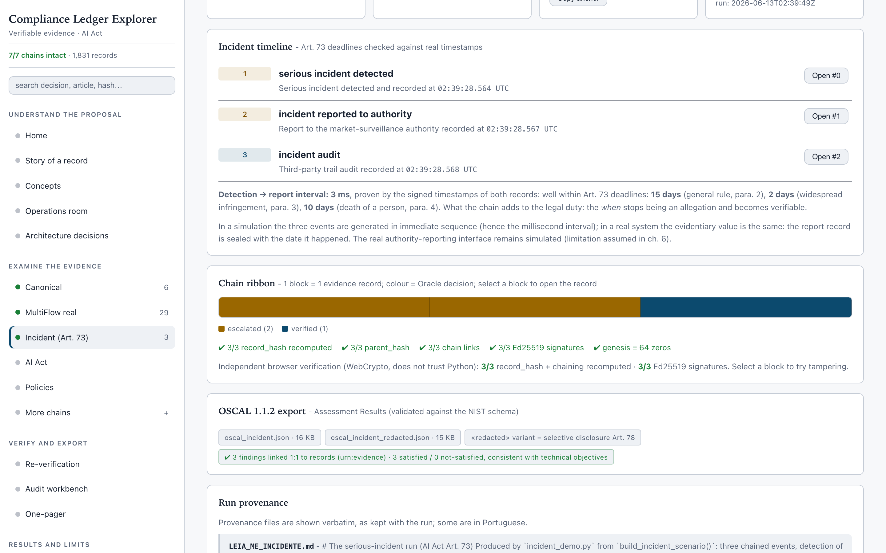

1. Open «Incident (Art. 73)» and use «On this page» to reach the timeline.
2. Click «Open #…» at detection. Read event, declared time and decision; close with `×`.
3. Repeat for the simulated report and audit query. Compare their times with the timeline intervals.
4. Consult ribbon and browser verification. «Records» shows all three stages and their details.
5. To inspect the normative association, open Article 73 evidence through «AI Act».

The timeline is computed from preserved timestamps. It lets you inspect the experiment and its displayed deadlines without sending a report.

### Inspect cost, spread and tamper detection

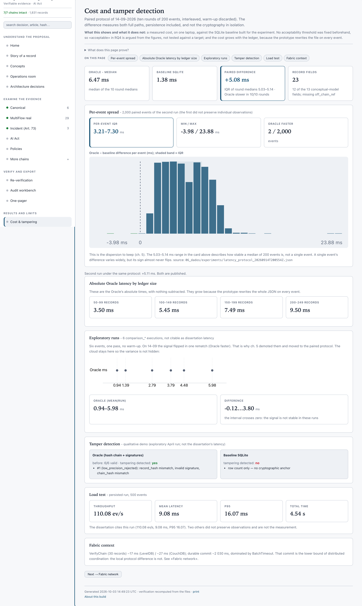

1. Open «Cost & tampering» and expand «What does this page prove?». Read the measurement protocol and scope.
2. Choose «Per-event spread» in «On this page». Hover over a histogram bar for the difference interval and number of events.
3. Choose «Absolute Oracle latency by ledger size» to compare cost as the file grows. Cards present values for reading.
4. In «Exploratory runs», hover over a point for run, Oracle time and difference. These points do not open records.
5. Choose «Tamper detection» and compare Oracle failures with the baseline. This panel preserves an experiment result; to alter a copy, open canonical #1 as in section 4.
6. Consult «Load test» and «Fabric context». For distributed measurements, open «Fabric network».

### Open Fabric measurement provenance

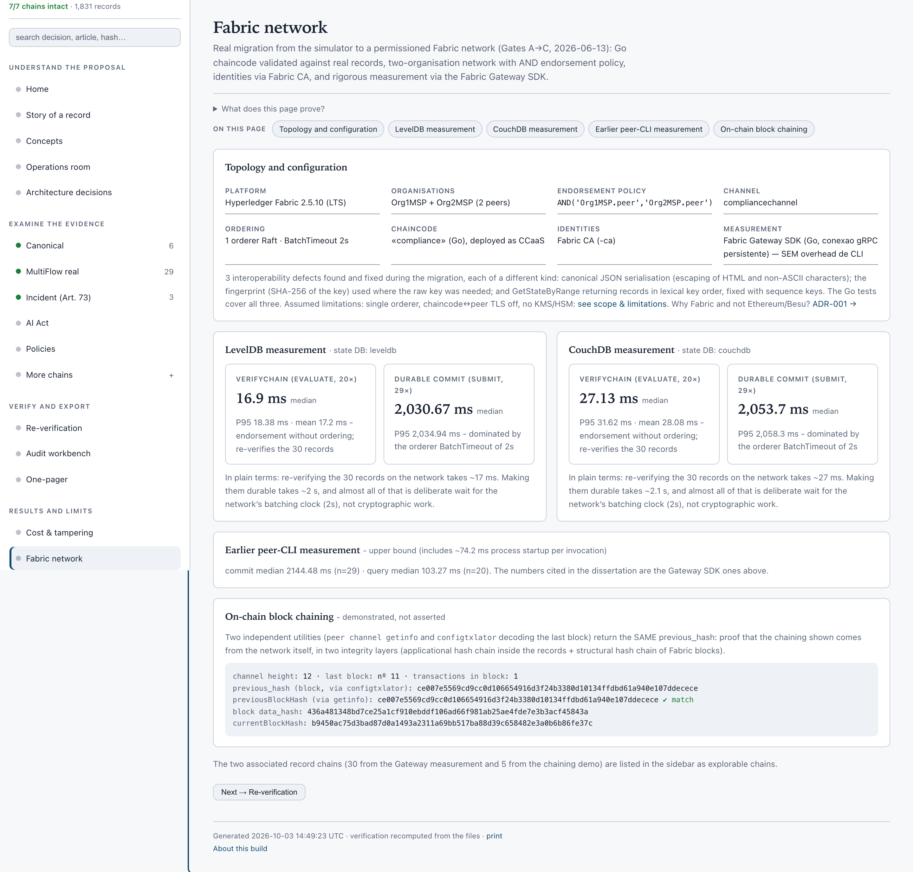

1. Open «Fabric network» and use «On this page» for topology or LevelDB/CouchDB measurements. Compare verification with submission through commit.
2. Click «Provenance: DESCRICAO_gateway.txt» for the preserved methodological narrative; click again to collapse it.
3. Open «Provenance: DESCRICAO.txt» for the other narrative. You need not execute any commands quoted there. These source narratives remain in Portuguese.
4. Choose «On-chain block chaining». Compare the two `previous_hash` values and match result. The panel presents preserved evidence and does not query a running network in this session.
5. In the topology note, click «ADR-001 →» for the platform choice, or «see scope & limitations» for constraints.
6. Under «More chains», open Fabric 30 or Fabric 5 and use the table, ribbon and detail to inspect their records.

### Consult limitations

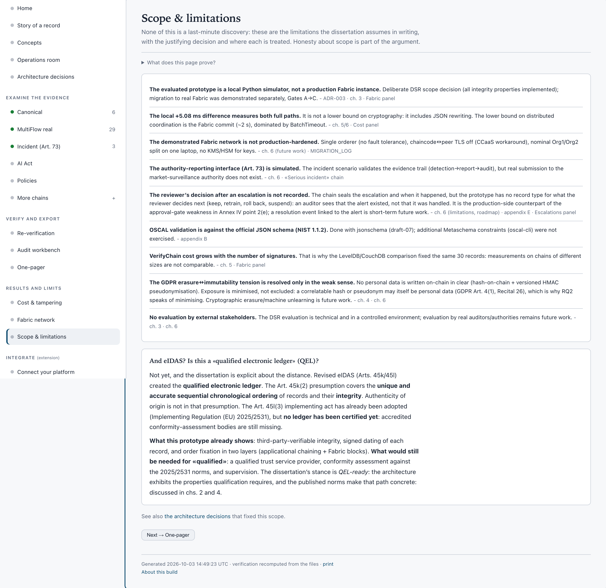

Read the panels in «Scope & limitations» and the chapter cited for each limitation. Chapter references do not open the dissertation. At the bottom, click «the architecture decisions» to compare a constraint with the design decision.

## 7. Re-verify in the browser

### Compare an anchor

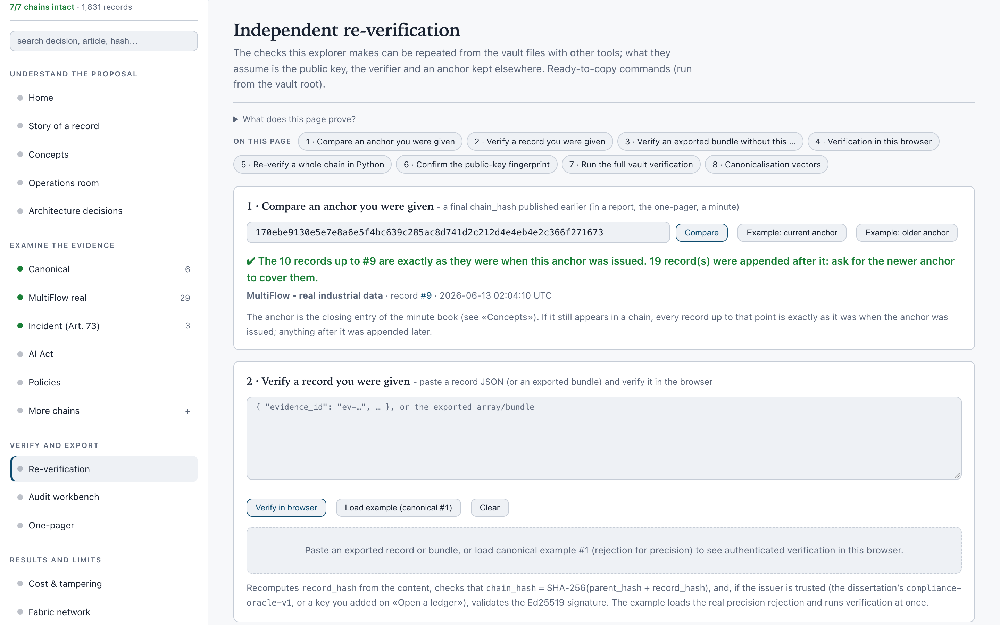

1. Open «Re-verification» and find «Compare an anchor you were given».
2. Paste the `chain_hash` received from a trusted source and select «Compare».
3. Read whether it matches the current anchor, an earlier anchor, a chain with issues or an unknown value.
4. Try «Example: current anchor» and «Example: older anchor» to learn the difference.

An earlier anchor covers only the prefix ending at that record. Preserve the reference outside the package being verified: replacing the chain and its own reference together removes that trusted comparison point. Events never received require reconciliation with the issuing source.

Example buttons fill the box and compare immediately. In the result, click «#…» to open the position where the anchor was found. If you paste a `record_hash` instead of `chain_hash`, the page explains the difference and offers «open →» for that record. Close with `×` before pasting another value.

### Verify a record or bundle

A bundle gathers records, public keys and verification instructions in a JSON file, a text format structured by fields. You can verify it in the browser without executing its technical instructions.

1. On the same page, find «Verify a record you were given».
2. Paste JSON for one record, a record list or a bundle.
3. Select «Verify in browser». For a first exercise, use «Load example (canonical #1)».
4. Read `record_hash`, `chain_hash`, predecessor-link and signature columns.

5. Read the summary above the table and any invalid-field, unknown-key or unavailable-signature messages. `n/d` indicates a check that could not be completed.
6. Replace the JSON and click «Verify in browser» again to repeat. «Clear» empties the input and result.

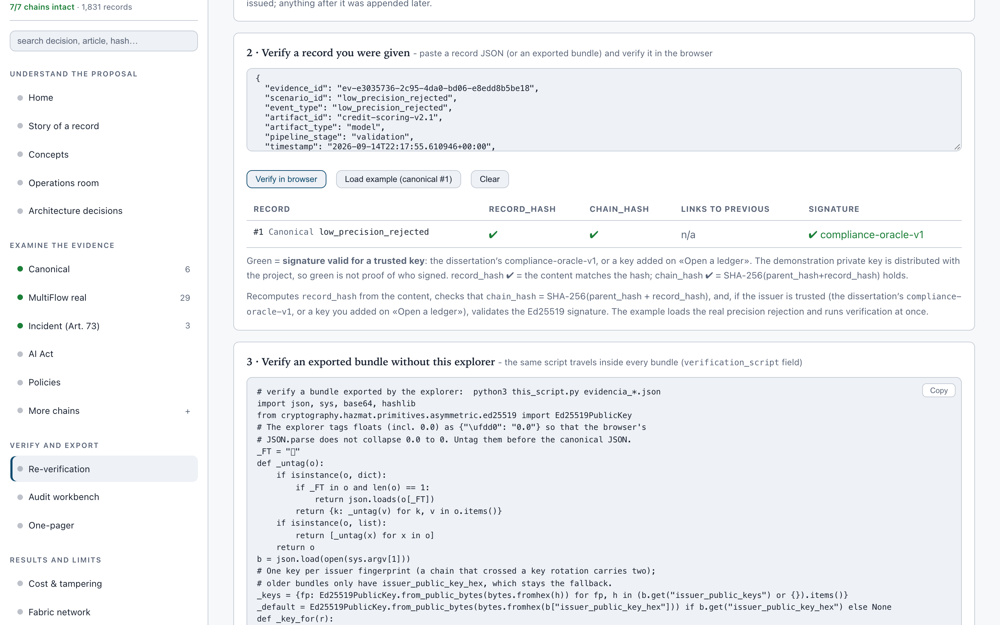

An isolated record does not allow checking the absent predecessor. In a positioned subset, links are checked only between consecutive neighbours. Green indicates a valid signature under a recognised key; grey `✔¹` indicates consistent hashes without authentication by a trusted key.

The prototype key is for demonstration; its corresponding private key is included in the project. The signature therefore does not establish who issued a record. For an external issuer, obtain its public key through a trusted channel and enter it in «Open a ledger».

In «On this page», choose «Verification in this browser» for support requirements and «Canonicalisation vectors» for the automatic check of 19 examples. Wait for recomputation to finish and read how many reproduced, and any divergences.

Code panels are technical references. Copying their text does not execute it. The anchor comparison, pasted JSON and audit workbench perform this manual's tasks in the browser.

## 8. Create and re-check a working paper

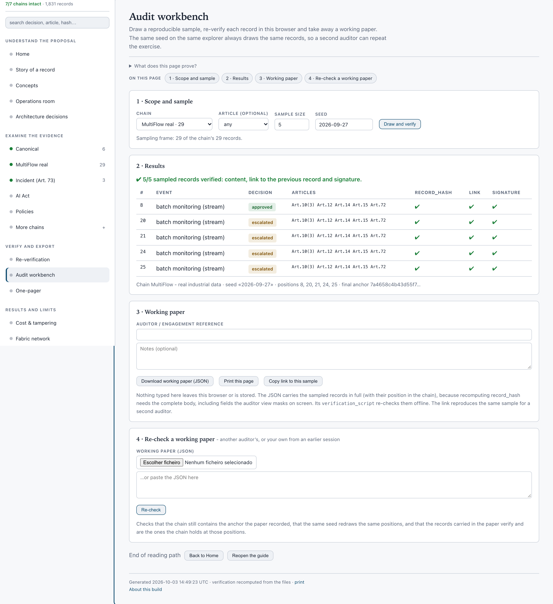

«Audit workbench» lets you repeat a selection of records. A seed is text determining the sample: the same data, parameters and explorer version produce the same positions.

1. Choose a chain and, if needed, an article.
2. Set the sample size and enter a seed, such as `review-2026-10-04`.
3. Select «Draw and verify».
4. Read the scope and content, link and signature results. Click a record to inspect it.
5. Fill «Auditor / engagement reference» and any notes to preserve.
6. Select «Download working paper (JSON)». You can also print the page or copy the sample link.

For Steel, sampling uses the 62 complete records in the HTML, not all 1,750. The workbench identifies this population. Do not extrapolate the sample to a full verification in this session.

### Examine results and preservation controls

1. In «Results», check chain, seed and positions in the note below the table. Compare each row's hash, link and signature separately.
2. Click a row, or select it with `Tab` and press `Enter`, to open its detail. Expand fields and OSCAL when present, then close with `×`. Steel's dialogue still shows a compact record; the working paper preserves the full record used for verification.
3. Enter the review reference in «Auditor / engagement reference» and fill «Notes (optional)». Both enter the working paper.
4. Click «Download working paper (JSON)», available after drawing a sample.
5. Click «Copy link to this sample» to preserve chain, size, article and seed. Read the scope beside it.
6. Click «Print this page». Review browser preview and choose printing or saving as PDF.
7. If you change chain, article, size or seed, click «Draw and verify» again before preserving the new result.

To repeat another person's work, choose the JSON file in «Re-check a working paper». File selection starts the check. Alternatively, paste its contents and select «Re-check». The explorer compares chain and anchor, repeats the seeded selection and compares the records with the results table.

An external chain must already be open. In a new session, load external files in the same order and enter their public keys: local identifiers depend on opening order. Closing and reopening a chain in the same session may change its identifier; start in a new tab and follow the original order in that case.

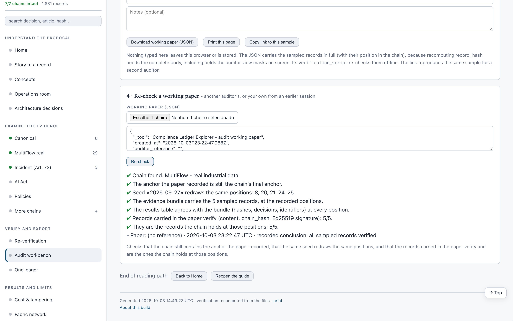

Read chain identification, anchor, seed/positions, bundle consistency and result-table checks, as well as the new cryptographic verification. To re-check text, replace all input and click «Re-check». Choosing another file starts the operation automatically. Matching parameters do not replace checking the records.

The working paper includes full sampled-record fields even with Auditor view on. Review its contents before sharing. A link reproduces the selection; it does not carry local files, notes or trusted keys added to the session. An external-chain recipient must load the same file at the same position in the opening sequence.

## 9. Export and preserve results

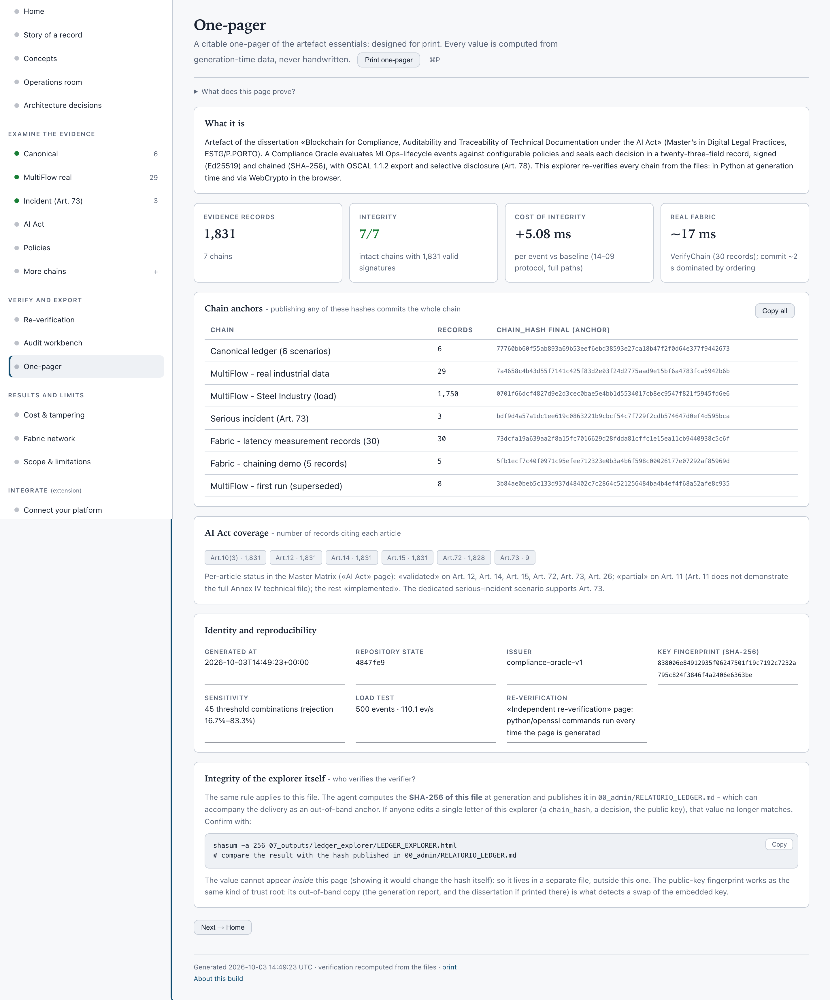

Choose the export for the content you need:

| Control | Content and purpose |
|---|---|
| «Export bundle» on a short chain | Complete chain records, public keys and a verification recipe. Table filters do not reduce this export. |
| «Export these N (bundle)» | Records matching active filters, with source positions, where this export is available. |
| «Export record» in a dialogue | The selected complete record. Isolated verification does not establish chain completeness. |
| «CSV» | Rows and columns for spreadsheet analysis, with active filters applied. It does not replace a verifiable bundle. |
| «Download working paper (JSON)» | Scope, seed, positions, notes, results and complete sampled records. |
| «Print one-pager» | Summary of chains, anchors and build-time results. Browser printing also allows saving as PDF. |

The long embedded chain does not offer full-bundle or individual compact-record export. Use the workbench for a complete sample, or load a received full ledger in «Open a ledger».

Downloads go to the folder selected or configured in the browser. Preserve original JSON to repeat verification. Changing CSV presentation does not change the ledger, but CSV does not contain the complete body needed for recomputation.

### Export a full chain and a filtered subset

1. In «Canonical» → «Records», click «Clear», then «Export bundle (6)» for all six records.
2. Click «rejected». «Export these 3 (bundle)» appears; click it for the three rejections with source positions.
3. Click «CSV» with the filter active to export those three rows. «Export bundle (6)» still exports the full chain.
4. Open a row and click «Export record» to download only that record.
5. Open the downloaded JSON in a browser tab or text viewer and copy it into «Re-verification». A list or bundle can also be loaded directly through «Open a ledger».
6. Return to the chain and select «Clear» before another query.

### Copy anchors and print the one-pager

1. Open «One-pager» and find «Chain anchors».
2. Click a row's final hash to copy that anchor, or «Copy all» for the set.
3. Click «Print one-pager». Check scale and pages in the browser dialogue, then print or save as PDF.
4. Preserve the generation date with the sheet. Its figures describe dissertation chains; files opened during this session do not enter those totals.

OSCAL export filenames on chain pages identify source artefacts. They are not download buttons. Use the controls above for record downloads, or the record detail to inspect an OSCAL pair.

## 10. Open files from another platform

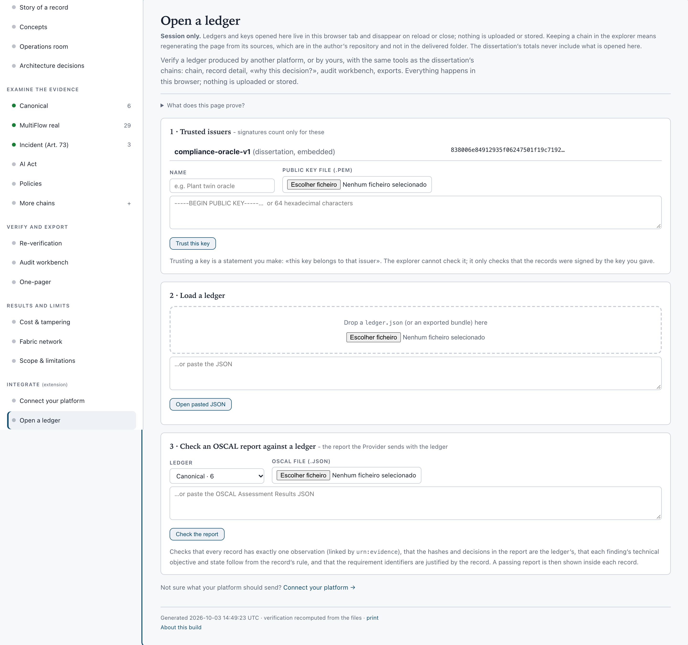

A ledger is a list of records in the explorer's accepted format. «Open a ledger» reads a compatible file or exported bundle. Loaded files remain available only in the current tab.

For a repeatable browser exercise, the package includes a synthetic external example: [ledger with 26 records](exemplos/twin-factory.json), [public key](exemplos/twin-public-key.pem) and [OSCAL report](exemplos/twin-oscal.json). Save the three files, then follow the steps below. They are demonstration files from the integration kit and do not enter dissertation totals. Their key is a demonstration reference, not an independently certified issuer identity.

### Enter the public key

1. Obtain the issuer's public key and confirm its origin through a trusted channel.
2. Under «Trusted issuers», enter a name identifying the issuer.
3. Select its PEM public-key file, whose text starts with `BEGIN PUBLIC KEY`, or paste the key. A public key of 64 hexadecimal characters is also accepted.
4. Select «Trust this key» and confirm it appears in the list.

The name is a label you choose. The application checks the signature under that key; it does not certify the issuer's legal identity. Use only the public key.

### Load and inspect

1. Under «Load a ledger», choose the JSON file or drop it in the loading area. File selection starts reading automatically.
2. Alternatively, paste the content and click «Open pasted JSON».
3. Read the loading message. On opening, check the session-loaded-file banner and verification results.
4. Return to «Open a ledger» and find «Loaded in this browser». Click the chain name to reopen it.
5. Use filters, ribbon, detail and exports as for other short chains. The workbench also allows selecting it.
6. To remove it, return to the loaded list and click «close».

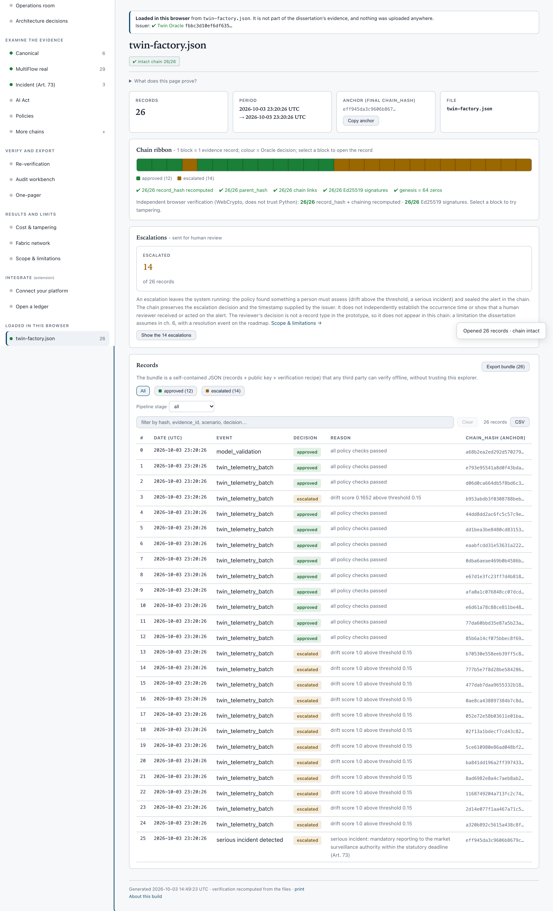

This screenshot shows `twin-factory.json` with 26 records. With its public key trusted and Ed25519 support, expect 26/26 verified signatures. The older Portuguese screenshot illustrates a different external example with 14 records; neither is a dissertation chain.

Identical content opened twice does not create a second chain. Files with the same declared anchor but different contents remain separate, and the explorer flags the conflict for inspection. A one-record bundle or list can appear as a fragment; completeness remains unknown. For a single record object, use «Re-verification»: «Open a ledger» requires a list or bundle.

On a format error, read the record number and field. Correct the source export; do not remove signed fields to make it pass.

«close» removes a loaded file from this session. You can also remove external issuer keys. Reopen the file and enter its key again in another session.

### Check the OSCAL report

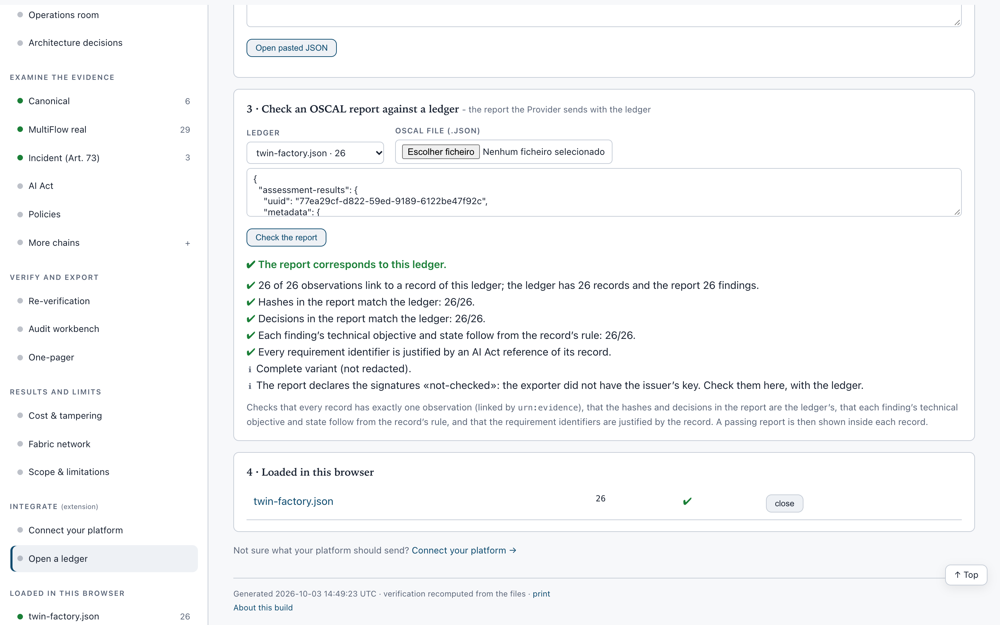

1. In «Check an OSCAL report against a ledger», select the corresponding chain.
2. Choose the OSCAL JSON file. Selection fills the box and starts checking against that chain.
3. Alternatively, paste the report and click «Check the report». If you change the chain after file selection, click this button again.
4. Read the observation/record, hash, decision and technical-objective results, including any divergences.
5. If accepted, open the chain, click a record and expand «see the real OSCAL of this record». The associated pair becomes available there.
6. For the reduced presentation, perform section 12's exercise and restore Auditor view to `off` afterwards. Simple mode stays `off`.

`urn:evidence` identifies the record an observation refers to. An accepted report appears in record details. This checks projection consistency against the ledger; it does not independently authenticate the OSCAL report or perform a legal assessment.

«Connect your platform» explains the input contract and event examples for the team producing files. Operational integration with the Oracle requires work at the source; loading a ledger in this browser lets you examine its output.

### Consult the contract and integration examples

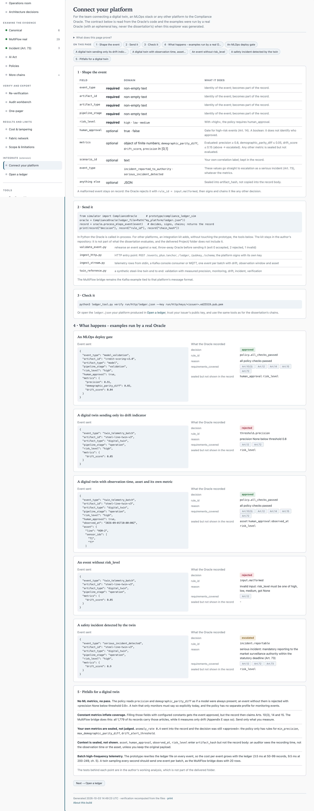

1. Open «Connect your platform» and select «1 · Shape the event» in «On this page». Read mandatory fields and accepted domains.
2. Find «What happens - examples run by a real Oracle» and the following examples. Compare «Event sent» with «What the Oracle recorded», including `rule_id`, reason and sealed fields absent from the record.
3. Read «Pitfalls for a digital twin». These are preserved results; there is no event-submission button.
4. In «3 · Check it», follow «Open a ledger» to examine a compatible file you received.

The page references a technical kit in the author's repository. That kit is outside the manual package and unnecessary for browser exercises.

## 11. Present and discuss the proposal

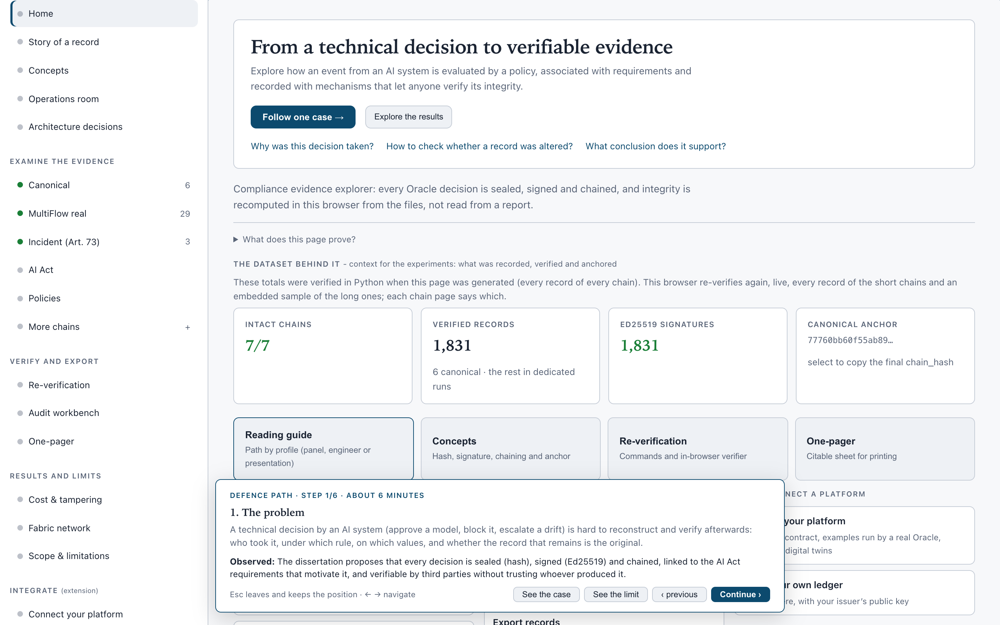

Confirm «Simple mode: off» and «Auditor view (Art. 78): off» before starting. Open [Defence path](../Project/ledger_explorer/LEDGER_EXPLORER.html#defesa/1) for the first of six moments. The «Tools» command can resume a previously saved position.

1. Read the title and observed result. «See the limit» reveals the caveat; click it again to collapse.
2. Click the evidence button shown below. Its label changes with the moment.
3. Use «Continue ›» to advance and «‹ previous» to return. «Finish» ends the final moment.

| Moment | Evidence button | Detail to open |
|---|---|---|
| 1. The problem | «See the case» | Story of canonical #1. |
| 2. Contribution in one case | «See why this decision» | #1 dialogue with rule, value and threshold. |
| 3. Integrity | «See the tampering» | Copy alteration and re-verification panel; finish with «Restore original». |
| 4. Confidentiality | «See the redacted OSCAL» | MultiFlow OSCAL section; Auditor view turns on for this moment. |
| 5. Viability and cost | «See the MultiFlow integration» | Integration chain and charts. |
| 6. The reach | «See Annex IV» | The 23-point panel, already expanded. |

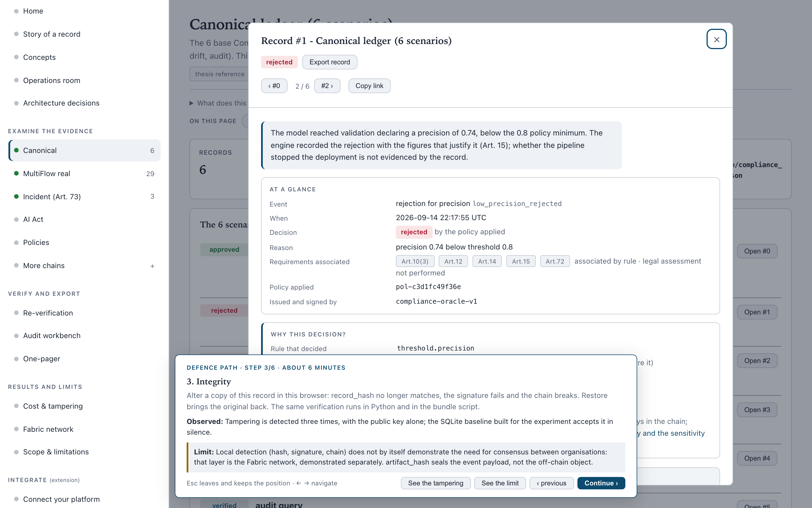

Press `Esc` to interrupt and explore a question. With a dialogue open, the first `Esc` closes it; the second exits the path. Resume from the menu's saved step, or use a link such as `#defesa/3` for that moment.

For a broader visit, choose [Presentation](../Project/ledger_explorer/LEDGER_EXPLORER.html#tour/1). Use «next ›» and «‹ previous», or `←` and `→`, across 14 steps. The tampering step opens the record automatically: alter the copy, restore it, then continue from the presentation bar. The selective-disclosure step enables Auditor view; the following step turns it off. «finish» ends the tour.

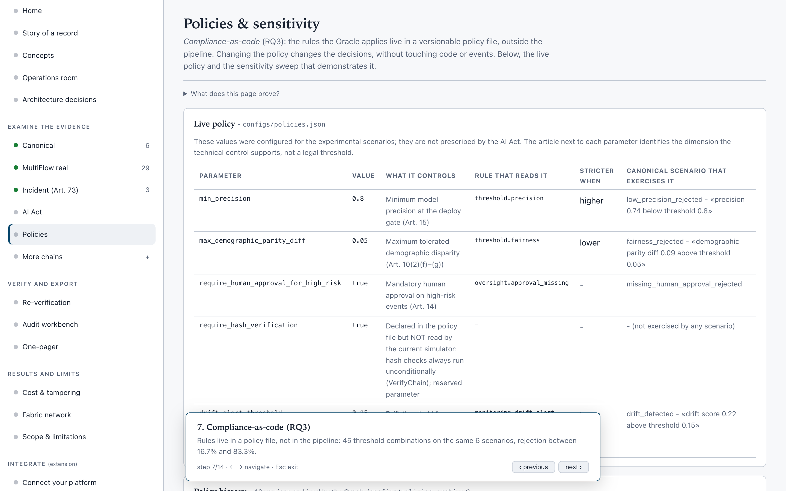

These paths retain the starting Simple mode state, so begin with it `off`. They change Auditor view at selective-disclosure moments and restore its initial state on finishing or exiting. Check both settings before returning to free exploration.

Examiners and supervisors can open the article, policy or record being discussed directly. After verification, preserve chain, position, `evidence_id` and anchor. These references let you return to the record; a screenshot only illustrates what was displayed.

## 12. Views, states and shortcuts

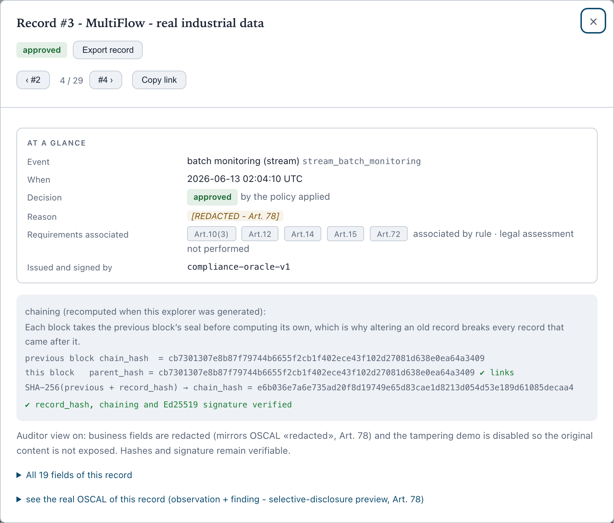

«Auditor view (Art. 78)» masks reason, artefact identity/type and pipeline stage on screen. It demonstrates the reduced presentation. Masked fields remain in the HTML and may enter bundles and working papers; this setting does not control file access. CSV respects the fields masked in that view.

### Compare full view with selective disclosure

1. Confirm «Simple mode: off». Open a record with OSCAL, read its fields and complete pair, then close with `×`.
2. In «View», click «Auditor view (Art. 78)» to change from `off` to `ON`.
3. Reopen the same record. Inspect masked-field markers and expand «see the real OSCAL of this record». Where a redacted variant exists, the preview uses it.
4. Close the dialogue and click «Auditor view (Art. 78)» again to restore `off`.
5. Reopen the record and confirm its full values returned. Tampering becomes available again for complete records.

Simple mode stays off throughout this comparison.

Keep «Simple mode» at `off` throughout this manual. If the application reopens with it `ON`, click to restore full view; an earlier visit may have saved that choice.

Change the theme with the theme control in «View»; its label offers the alternative theme. «PT · EN» or «EN · PT» switches language. These choices do not change data. The browser retains language, Simple mode and theme when local storage is allowed. Both languages use the same chains and tools.

Read each state according to its object:

| State | Meaning |
|---|---|
| Approved, rejected, escalated or verified | Engine-declared decision. «Verified» is also the query scenario's decision name; it does not replace cryptographic checks. |
| Confirmed hash, link or signature | Result of the identified check on received content. Each check has its own scope. |
| Green or grey `✔¹` | Valid signature under a recognised key, or consistent hashes without authentication by a trusted key, respectively. |
| Intact | Verifier checks passed within the stated scope. It does not prove capture of every source event. |
| Fragment | Context is missing for a conclusion about the whole chain. |
| Validated, implemented or partly supported technical control | Master Matrix status, not a global legal-conformity finding. |

| Key | Action |
|---|---|
| `/` | Open search. |
| `?` | Reopen Reading guide. |
| `Esc` | Close a dialogue or exit a path. |
| `←` and `→` | Move between records or presentation steps. |
| `Space` | Play or pause Operations room replay. |
| `Home` | Return to the page top. |

Navigation shortcuts act outside text fields. `Tab` and `Shift` + `Tab` move among controls; `Enter` opens a selected record row. With a dialogue open, `Home` does not change the page.

Loaded data, external keys and notes do not survive reloading or closing the tab. Download the working paper before ending. Embedded records remain in the received HTML file.

## 13. Troubleshooting

| Situation | Browser action |
|---|---|
| Blank or incomplete page | Extract the compressed folder and open the HTML in a browser. Obtain the file again if incomplete. If browser policy blocks local scripts, use the published link supplied by the responsible person or another authorised browser. |
| Signatures unverified | Read the support warning and update the browser or try another. Preserve the result as partial until signature verification succeeds. |
| «unknown issuer» | Enter the public key in «Open a ledger» after confirming its origin. Consistent hashes do not establish authorship. |
| A control is missing | Turn Simple mode off. For tampering, also turn Auditor view off and choose a complete canonical record. |
| Filter finds no records | Select «Clear» and check the chain. Global search and table filters have different scopes. |
| Unknown anchor | Check all 64 characters and the chain version. Clarify the source of a divergence; do not replace the received reference just to obtain a match. |
| Re-check cannot find the chain | In a new tab, load external ledgers in the original order, enter their keys and confirm versions. Closing/reopening a ledger changes its local identifier. |
| JSON or OSCAL refused | Read the reported field and confirm the required file type. CSV is neither a ledger nor an OSCAL report. |
| Download missing | Check browser downloads and configured folder, including any save permission prompt. |
| Loaded files or notes lost | Reopen source files and use the downloaded working paper. Session-only notes cannot be recovered by the explorer. |
| Copied link fails on another computer | A local link requires a copy of the explorer. Use a published link, or open the copy and append the page/record suffix. |
| Manual images missing | Keep `capturas_en` beside `USER_MANUAL.html` and extract the entire package. |

To identify the version in a discussion, open «About this build» in the footer. Record generation date, chain and observed message to distinguish a usage problem from differences between distributed files.
